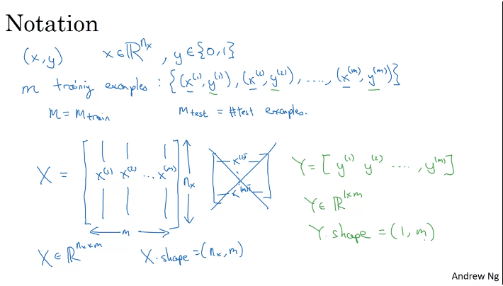
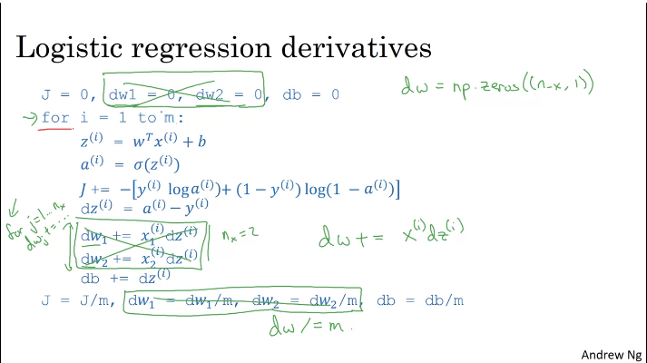

**Neural Network and Deep Learning**

# Introduction

> Deep Learning: Training Neural Network
[Course Notes Here](https://community.deeplearning.ai/t/dls-course-1-lecture-notes/11862)

## What is Neural Network?

> A single neuron(perceptron) can behave like a straight line.

- Simple linear relation isn't often not enough.
- So, we might need multiple variables and thus multiple relations.

- The main deal with neural network is that we don't explicitly program those individual nodes and tell them to give fixed output. This is figured out by *almost* trail and error based on given data(training data) which are just examples.

## Supervised Learning with Neural Networks

- Almost all of the economic value created by NN so far has been in supervised learning.

- Here, we have some labelled dataset and out job is to classify input provided to the network.

- Real State, Online Advertising : Standard NN
- Image applications: CNN
- Speech Recognition: RNN 
- Machine Translation: RNN
- Autonomous driving : Custom/Hybrid

## Structured Vs Unstructured Data

> Structured data are often organized in form of table and Unstructured Data are data like audio, image, text.

- Its hard for computer to understand unstructured data and easier for human.

## Why is Deep Learning taking off?

- Although the idea behind deep learning has been around for a long time, it has only recently taken off.

- Reasons:
    - Neural Network's performance increases with increase in data
    - Computation
    - Algorithms

> Problem with sigmoid: the top and bottom regions have very low gradient => slower training (gradient descent). This was rectified by ReLU

# Binary Classification

- Logistic Regression is an algorithm for binary classification.
- Binary classification is problem associated with assigning one of the two classes to input. For eg: Figuring out if an image is of cat or not.

- Example:
    - Consider a 64*64 image we want to classify.
    - We first convert the pixel values to feature vector of size 64*64*3 = 12288 = n = nx.
    - Our goal is to train a classifier to predict whether a given image is of cat or not.
    - m = mtrain number of training example

## Logistic Regression

- Given x, we want an algorithm that can predict y which is really P(y=1|x).
- Parameters: w (weights), b (bias)
- Output: 
    - Naive = y = wT + b which doesn't work. This is linear regression
    - We actually multiply this by sigma to get y = σ(wT + b).
        - σ(z) = 1 / (1 + e^-z) is the sigmoid function
        - If z is very large, σ(z) is close to 1
        - If z is very small(i.e very large negative number), σ(z) is close to 0

- We won't be using notation where bias is included in a 1d column matrix with weights.

- Cost function:
    - Squared error doesn't work as the curve gets convex and gradient descent doesn't work.
    - So we use - `-(y * log(ŷ) + (1 - y) * log(1 - ŷ))`
        - When y = 1, loss = -logŷ <- We want ŷ to be large
        - When y = 0, loss = -log(1-ŷ) <- We want ŷ to be small
    - Loss function is for one prediction and label. Cost function is for entire training set.

## Gradient Descent

- In cost function, we want w,b that minimizes J(w,b)
- We start by initializing the weight and bias to 0.
    - We can use random initialization but it is often not done

- Gradient descent:
    - Update w repeatedly:
        - w := w - α * ∇J(w, b) // ∇J(w, b) is partial derivative wrt w i.e slope of function at a point wrt b
        - Similary, we update b using partial derivative wrt b

## Computation Graph

> Computation in NN = Forward Pass + Backward Pass

- Consider we are trying to compute J(a,b,c) = 3(a+bc)
    - First compute u = bc
    - Then compute v = a+u
    - Then J = 3v
- Then we get this computational graph:

- In forward pass, we calculate the value of J.
- In backward pass, we calculate derivatives of J.

- How does derivative using computational graph work?
    - Derivative is just how much J would change if we changed v a little.
    - Here if you change v by 0.01, J changes by 0.03 => derivative is 3
    - Also, increasing a by 0.01 will cause v to change by 0.01 and consequently J by 0.03.

## Logistic Regression Gradient Descent

[Derivative of LogR Cost Function](https://community.deeplearning.ai/t/derivation-of-dl-dz/165)

- This has issue:
    - There is a nested for loop which is really bad in terms of efficiency.
    - Solution: Vectorization.

- In deep learning, vectorization is really important.

## Vectorization

- Way to remove explicit for loops in your code.

> While you would use for loop to iterate over each item in non-vectorized approach. In vectorized form, the looping is delegated to highly optimized C and Fortran functions, resulting in faster and more efficient python code.

- This is based on SIMD (Single Instruction Multiple Data)

## Neural network programming guideline

- Whenever possible, avoid explicit for-loops.
- There are vectors and matrix valued functions in numpy. Prefer those over loops.

## Vectorizing logistic regression

