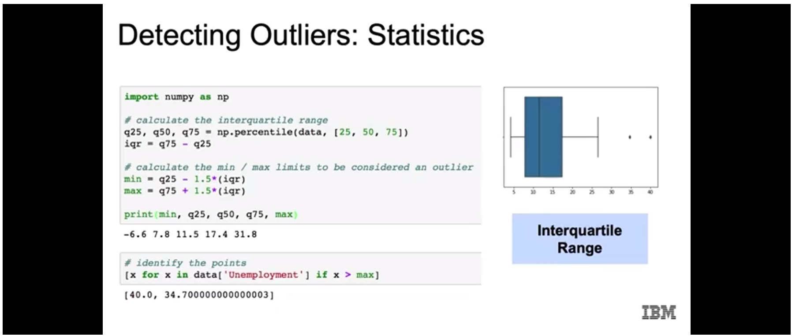
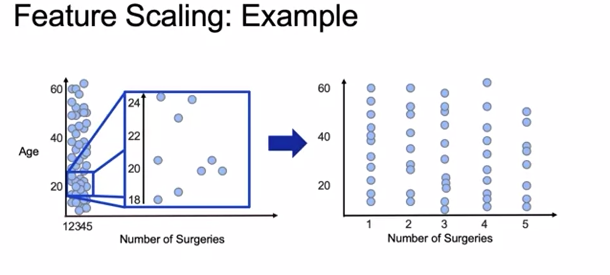
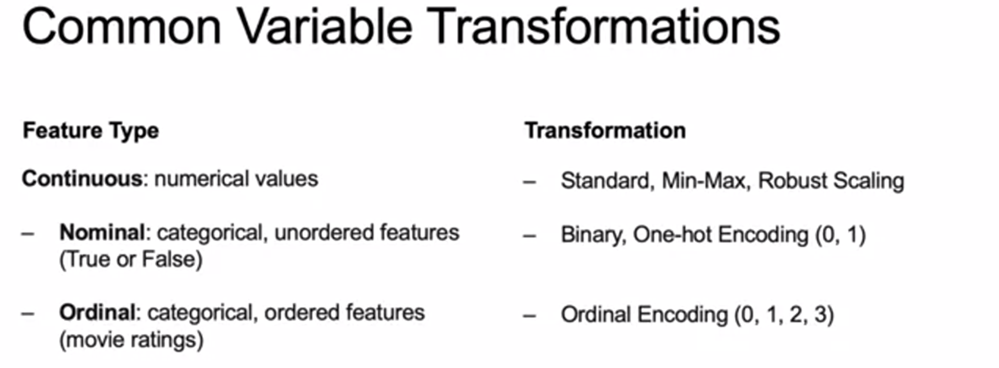

# Introduction to Artificial Intelligence and Machine Learning

> Artificial Intelligence is a branch of computer science dealing with the simulation of intelligent behavior in computers.

- Machine mimicing of cognitive functions that are associated by humans to human mind.

> Machine learning refers to algorithms whose performance improve as they are exposed to more data over time(they can plateau over time with diminishing return).

- Machine learning algorithms are not explicitly programmed but learn from repeatedly seeing data.

- Features are used to predict target. Both are columns in dataset.

- For supervised learning we have a target column. Goal is to make predictions. Eg. Fraud detection.
- For unsupervised learning we don't have a target column. Goal is to find structure in the data. Eg. Customer Segmentation. 

> Deep learning is subset of machine learning that involves using multilayered neural networks that learn from vast amounts of data.

> In traditional machine learning, we extract features outself and feed into the model but in Deep learning, we just feed data to neural network and it does the job of feature detection and the job required.


## History of AI
- Early algorithms in 1950's (Turing test, perceptron, checkers program algorithm)

- 1970s to 1970s - AI winter (Lack of yield on investment, limitation of perceptron, Lighthill report => government funding down)

- Then Expert systems (on LISP, used by fortune 500 companies), Neural Networks (back propagation algorithms)

- 1980s - 1990s - AI winter (inability to learn, NN didn't scale to large problem, interest declined)

- Machine learning and Deep learning (Lots of success, integration of algorithms, Deep Blue, Google search engine for pagering algorithm, deep learning, imagenet dataset, imagenet competition, translations, tensorflow, IBM project debater)

- Currently computer vision(health care, object detection), Natural Language Translation. * Faster computers, bigger datasets, neural nets => amazing results.

## Machine learning Workflow

- Problem Statement
- Data collection
- Data Exploration and Preprocessing
- Modeling
- Validation
- Decision making and Deployment

# Retrieving data

## From CSV
- Comma Separated values

- In pandas:
```py
import pandas as pd
filepath = 'data/file1.csv'

data = pd.read_csv(filepath) # import the data # sep=',' is default so no need to specify

print(data.iloc[:5]) # display first 5 datas
```

## From JSON files

```py
data = pd.read_json(filepath)
data.to_json('outputfile.json')
```

## From SQL data
> Different libraries are used for different databases

## Fromm NoSQL Databases
- Most use JSON format
- Document db, key-value db, graph db, wide-column stores.
- Different librarires like pymongo

## From APIs and Cloud data access
```py
df = pd.read_csv(data_url, header=None)
```

# Data Cleaning

## Importance:
- Importance of cleaning data:
    - Decisions and analytics are increasingly driven by data and models
    - Machine learning workflow depends on cleaned data

> "Garbage in, garbage out"

- Problems with data:
    - Lack of data
    - Too much data (Data engineering problem)
    - Bad data (GIGO)

- How can data be messy?:
    - Duplicate or unnecessary data
        - will increase weight of some features
    - Inconsistent text and typos
        - categorized as different even through they are same
    - Missing data
    - Ouliers
    - Data sourcing issues:
        - multiple systems
        - different database types

> Pay attention to duplicate values and research why there are multiple values. Sometimes duplicates are supposed to be there.

## Handling missing values and outliers

- Policies:
    - remove the data: entire row or columns
        - quick but loss of info and bias.
        - small number removal is fine most of the time
    - Impute the data: replace with substituted values
        - no loss but assumption about data
    - Mask the data: create a category for missing values

- Outliers:
    - Observations in data that are distant from most other observations.
    - Typically, they are aberrations and should be removed
    - Can be identified using plots, statistics, residuals

> some outliers are informative and provide insights into the data



- Residuals:
    - differences between actual and predicted values of the outcome variables
    - Approaches:
        - Standarized: residual divided by standard error
        - Deleted: residual from fitting model on all data excluding current observation
        - Studentized: deleted residuals divided by residual standard error (based on all or excluding current observation)

- Policies for outliers:
    - Remove them
    - Assign different value (mean, median)
    - Transform the variable
    - Predict what the value should be (in case of error)
        - using regression
        - using similar observation to predict
    - keep them (focus on model that are resistant to outliers)

# EDA and Feature Engineering

> EDA is an approach to analyzing the data sets to summarize their main characteristics, often with visual methods.

- Why?
    - get an initial feel for the data
    - determine if the data makes sense or it need further cleaning
    - helps identify patterns and trends in the data

- Techniques:
    - Summary statistics: average, median, min, max, correlations, etc.
    - Visualization: histogram, scatter plots, box plots, etc.

- Tools:
    - Data Wrangling: pandas
    - Visualization: matplotlib, seaborn

- Sampling from dataframes
    - For large data: random sample can make computation easier
    - Hold out some part for testing model
    - we may want to over- or under-sample observations when outcomes are uneven : stratified sampling should be done.

> Creating Grouped plots(of similar plots) is a good option most of the time

# Feature Engineering and Variable transformation

- Transforming the data so that it fulfills assumptions required for the model.

- For. eg: Prediction from linear regression models assume residuals are normally distributed.
    - Log transform helps reduce the skewness of data
    - log1p adds 1 before log (in case you have 0 in your data)

- Polynomial features can be added to estimate higher-order relationships

## Feature encoding

- Variable selection => choosing set of featurees to include in the model
- In addition to log and polynomial transformations, this can involve:
    - Encoding: converting non-numeric features into numeric features
    - Scaling: converting the scale of numeric data so they are comparable

- Encoding is often applied to categorical features, that take non-numeric values:
    - Nominal data: categorical variables that take values in unordered categories. For eg: blue, green, red; True, False;
    - Ordinal data: categorical variables that take values in ordered categories. For eg: High, Medium, Low

- Approaches:
    - Binary Encoding: For variable that can take two values only. Eg. Male/Female
    - One-hot encoding: Creates variables that take multiple values into binary(0,1) variables, one for each category. This creates several new variables.
    - Ordinal encoding: Involves converting ordered categories into numerical values. (High, Medium, Low => 3,2,1). Must take gap into account.

## Feature Scaling:

> Feature scaling involves adjusting a variable's scale.

- DIfferent data will have different scales.



- Approaches:
    - Standard scaling: converts features to standard normal variables. (substract mean and divide by standard error) (Susceptible to outliers)
    - Min-max scaling: Min to 0 and max to 1. (Substract min and divide by range). Sensitive to outliers.
    - Robust scaling: Similar to min-max but focuses on IQR.




# End note:

- Log Transform is a good way to correct for skewness of data
```py
def analyze_skewness(df, column):
    sns.displot(df[column])
    print("Skewness before log transform: %f" % df[column].skew())
    log_transformed = np.log(df[column])
    sns.displot(log_transformed)
    print("Skewness after log transform: %f" % log_transformed.skew())
# fairly symmetrical => -0.5 to 0.5
# modeerately skewed => 0.5 to 1.0 and -1.0 and -0.5
# highly skewed => <-1.0 and >1.0
```
    
- Pairplot is a good option to analyze correlation after using corr()

```py
def analyze_correlations(df, target_column):
    num_df = df.select_dtypes(include = ['float64', 'int64'])
    correlations = num_df.corr()[target_column][:-1]
    top_features = correlations[abs(correlations) > 0.5].sort_values(ascending=False)
    print("There is {} strongly correlated values with {}:\n{}".format(len(top_features), target_column, top_features))
    for i in range(0, len(num_df.columns), 5):
        sns.pairplot(data=num_df,
                    x_vars=num_df.columns[i:i+5],
                    y_vars=[target_column])
```

- You can plot bargraph between columns and total missing value to visualize missing values

```py
def plot_missing_values(df, top_n):
    total = df.isnull().sum().sort_values(ascending=False)
    total_select = total.head(top_n)
    total_select.plot(kind="bar", figsize = (8,6), fontsize = 10)

    plt.xlabel("Columns", fontsize = 20)
    plt.ylabel("Count", fontsize = 20)
    plt.title("Total Missing Values", fontsize = 20)
```

- Feature Scaling:
    - Getting all attributes to have same scale
    - Min-Max scaling: (between 0 and 1):
        - Subtracting the min value and dividing by max minus min
    - Standarization:
        - Subtract mean and divide by standard deviation

> scikit-learn has `MinMaxScaler` and `StandardScaler` for standarization needs.