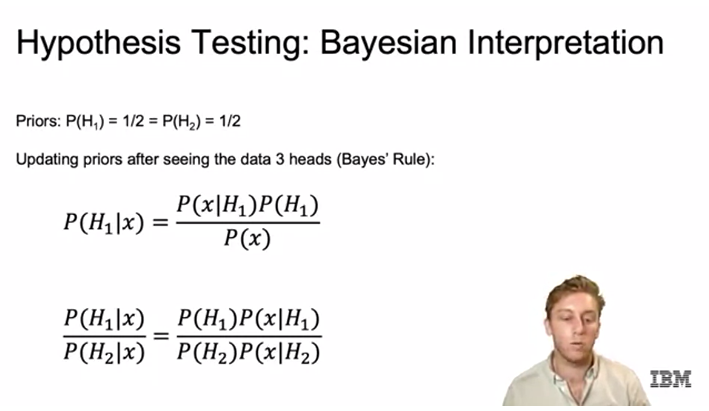
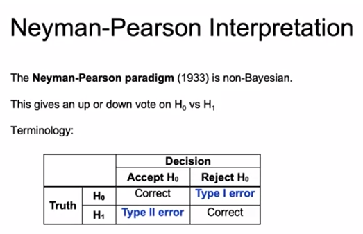
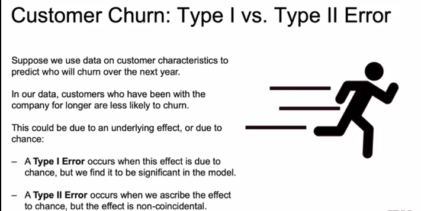
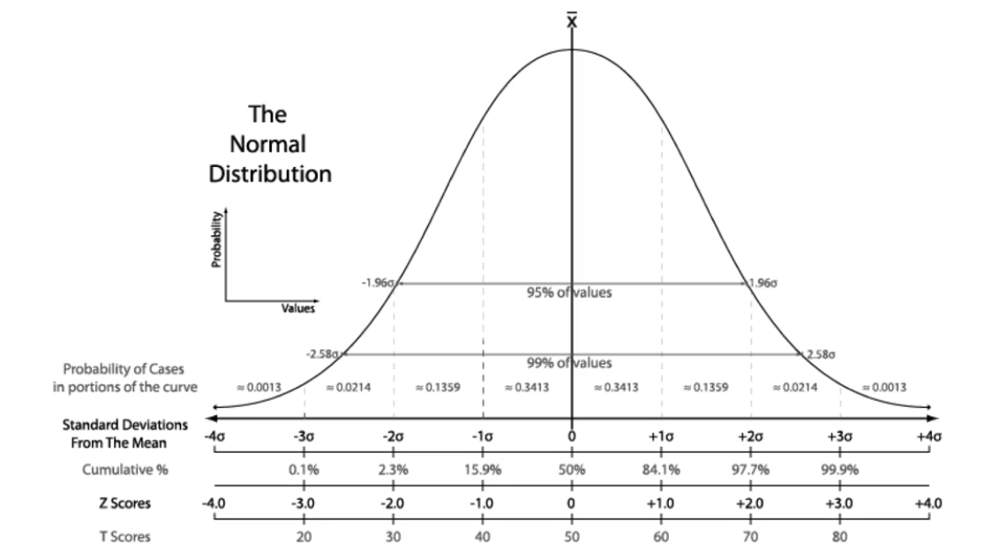

# Hypothesis Testing

- A hypothesis is a statement about a population parameter.

- We create two hypothesis:
    - The **null hypothesis** (H0)
    - The **alternative hypothesis** (H1 or HA)

A hypothesis testing procedure gives us a rule to decide:
    - For which values of test statistic do we accept H0
    - For which values of test statistic do we reject H0 and accept H1

## Example 1: coin toss

- Consider two coins:
    - Coin 1 has a 70% probability of coming up heads.
    - Coin 2 has a 50% probability of coming up heads.

Pick one coin without looking.

Toss the coin 10 times and record the number of heads.

Given the number of heads you see, which of the two coins did you toss?

Soln:

Given what we know about coins 1 and 2, we can make a table of the probability of seeing x heads out of 10 tosses.

If number of heads shows up higher times, we can say that likelihood of it being coin 1 is better.

> Likelihood ratio => ratio of how likely is null hypothesis is compared to alternative.

## Bayesian Interpretation of Hypothesis Testing example

In the Bayesian interpretation, we need priors for each hypothesis:
    - In the case above, we randomly choose coin to flip
    - P (H1 = we chose coin 1) = 1/2 and
    - P (H2 = we chose coin 2) = 1/2

Since we have no way, before seeing the data, to determine the coin that was chosen, we just assign 1/2 to each.

We then update priors after seeing some data:

- The priors are multiplied by the likelihood ratio, which doesn't depend on the priors.

- The likelihood ratio tells us how we should update our priors.

## Type I vs Type II Error

Type 1: Incorrectly rejecting the null hypothesis
Type 2: Incorrectly accepting the null hypothesis

Power of a test = 1 - P(Type II error)

## Terminologies

- Likelihood ratio is called a test statistic: we use it to decide whether to accept or reject the null hypothesis

- Rejection region: set of values that lead to rejection of null hypothesis
- Acceptance region: set of values that lead to acceptance of null hypothesis
- Null distribution: test statistic's distribution when the null is true

## Significance level and P-values

- Significance level (alpha) is a probability threshold below which the null hypothesis will be rejected.

> We must choose an alpha before computing the test statistic. If we don't, we might be accused of **p-hacking**

- If you want to avoid type I error, choose very low alpha. (i.e. incorrect rejection)

- Common p-values are 0.01 or 0.05. In medication and critical field, 0.005 even or less

- P-value: smallest significance level at which the null hypothesis would be rejected.
- Confidence interval: the values of the statistic for which we accept the null.

## Correlation vs Causation

- Example: Does it rain more on cooler days?
    - Maybe depends on where you are
    - Warmer => evaporation => rain for summer monsoons but cooler decreases dew point and rain
    - So maybe not causing.

- If two variables are correlated, one might be useful for predicting other.

- We might be able to use correlation for better model.

- X and Y can be correlated for different reasons:
    - X causes Y (what we want)
    - Y causes X (mixing up cause and effect)
    - X and Y are both caused by something else (confounding)
    - A and Y aren't really related at all (spurious)

- Examples:
    - Student test scores are correlated with amount of time studied. Doesn't mean we should curve grades upward to get students to study more.

- Confounding variable: something that causes both X and Y to change.

- Example of compounding variables: The number of annual car accidents and the number of people named John are positively correlated (both are correlated with population size)

- The amount of ice-cream sold and the number of drownings in a week are positively correlated (both are positively correlated with temperature)

- Spurious correlations
    - These are correlations that are just "coincidences" duee to the particular sample, and would probably not hold on longer samples/different samples.

## Summary

- **Estimation and Inference**
    - Inferential Statistics involve learning characteristics of the population from a sample. The population characteristics are parameters, while the sample characteristics are statistics. A parametric model uses parameters like mean and standard deviation.
    - The most common way of estimating parameters in a parametric model is through maximum likelihood estimation.
    - Through a hypothesis test, you test for a specific value of the parameter.
    - Estimation represents a process of determining a population parameter based on a model fitted to the data.
    - The most common distribution functions are: uniform, normal, log normal, exponential, and poisson.
    - A frequentist approach focuses on observing many repeats of an experiment. A Bayesian approach describes parameters through probability distributions.

- **Hypothesis Testing**
    - A hypothesis is a statement about a population parameter. You commonly have two hypotheses: the null hypothesis and the alternative hypothesis.
    - A hypothesis test gives you a rule to decide for which values of the test statistic you accept the null hypothesis and for which values you reject the null hypothesis and accept the alternative hypothesis.
    - A type 1 error occurs when an effect is due to chance, but we find it to be significant in the model.
    - A type 2 error occurs when we ascribe the effect to chance, but the effect is non-coincidental.

- **Significance Level and P-values**
    - A significance level is a probability threshold below which the null hypothesis can be rejected. You must choose the significance level before computing the test statistic. It is usually .01 or .05.
    - A p-value is the smallest significance level at which the null hypothesis would be rejected. The confidence interval contains the values of the statistic for which we accept the null hypothesis.
    - Correlations are useful as effects can help predict an outcome, but correlation does not imply causation.
    - When making recommendations, one should take into consideration confounding variables and the fact that correlation across two variables does not imply that an increase or decrease in one of them will drive an increase or decrease of the other.
    - Spurious correlations happen in data. They are just coincidences given a particular data sample.