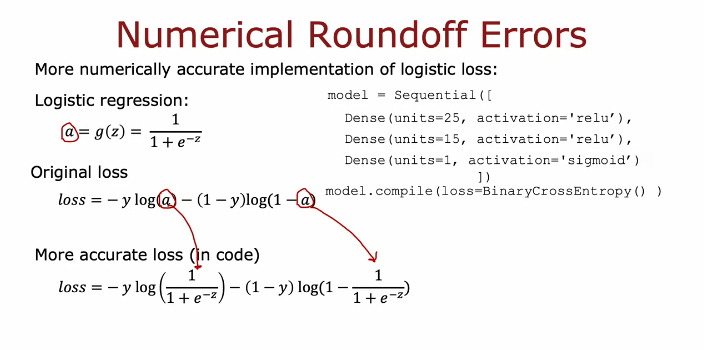
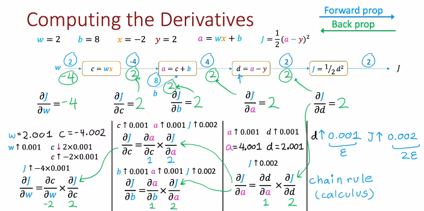
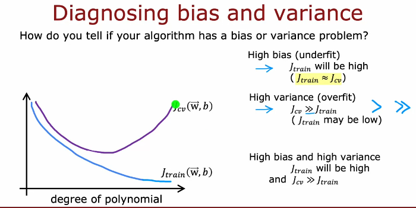
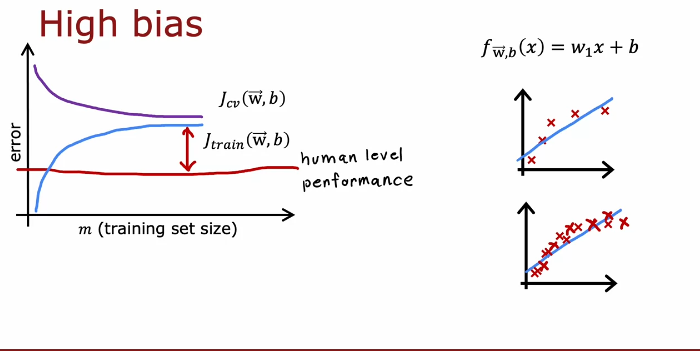
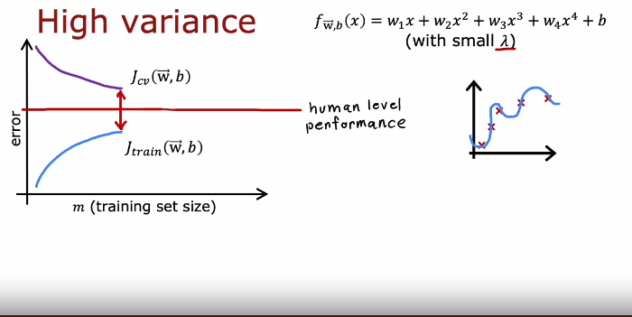
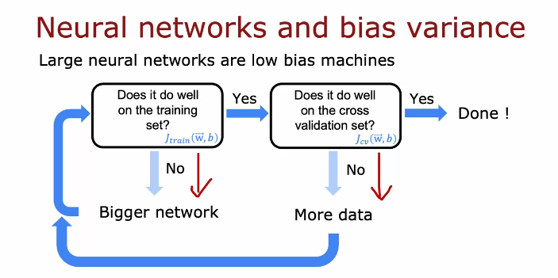
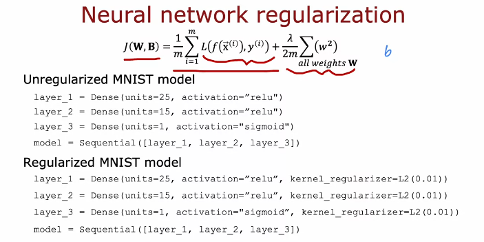

# Advanced Learning Algorithms

- Content:
    - Neural Networks
        - Inferencing from existing NN
        - Training your own
    - Practical advice for machine learning
    - Decision Trees

# Neural Network

> Algorithms that try to mimic the brain. Started 1980s and resurrected from around 2005

- Now, NN is nothing like brain but early motivation was from that.

- Neurons in the brain
    - Cell body 
        - neucleus (processing portion)
        - Dendrides (Input wire)
        - Axon (output wire)

- NNs are famous now due to increase inn amount of data.
    - Also, the computational power has increased
    - Traditional ML algorithms' performance pleateus(ie. doesn't give appreciable return on increase in data) but larger the NN, more data is better.

## Neural Network Intuition with Demand Production

- Suppose, you have price of t-shirt(input feature) and top seller or not (output)

- Suppose a neuron is sigmoid function.
    - A single neuron can be thought of like a small processor.

- Now, suppose we have four input features (price, shipping cost, marketing, material)

- We create layers, with each layer no. of neurons decrease i.e. we reduce no. of input for next layer.


## Recognizing Images

- Consider a grayscale picture
- Image as a 2D vector (with pixel intensity values)

> With each layer, higher level details are detected.(lines, curves... in first layer, eye in second, face shape in third and so on ... for example)

## Neural Network layer

> For each layer, input is some value and output is a activation value vector. (Output of simoid function applied to w*(input vector) + b)

- At last layer, you might threshold it if binary classification.

## More complex neural network

> When we say n layers, it included all hidden layers but not input layers.


- Notation:
    - Superscript denotes layer number
    - Subscript denote neuron number (for that layer).

## Inference in Code

- Coffee roasting example. (Properly cooked or not based on time and temperature)
```py
x = np.array([[200.0, 17.0]]) # Feature vector - array of two numbers
layer_1 = Dense(units=3, activation='sigmoid') # layer1 with 3 hidden units and sigmoid activation
a1 = layer_1(x) # output of layer1
# If you print a1, you will get a tf.Tensor([[0.2 0.7 0.3]], shape=(1,3), dtype=float32) -- Think of tensor as more efficient matrix

# You can use a2.numpy() to typecast it to numpy matrix
layer_2 = Dense(units=1, activation='sigmoid') # layer2
a2 = layer_2(a1) # Applying layer1

if a2 >= 0.5:
    yhat = 1
else:
    y_hat = 0
```

- That is how you inference. (Some parts are ignored here)

## Data in tensorflow

> There are some inconsistency in tf and numpy

```py
# consider this(that is used above):
x = np.array([[200.0, 17.0]]) # this is "2d" matrix

x = np.aray([200, 17]) # this is 1d "vector"

# Tensor flow works with matrix not vector
```

## Building a neural network architecture

```py
layer_1 = Dense(units=3, activation="sigmoid")
layer_2 = Dense(units=1, activation="sigmoid")

modl = Sequential([layer_1, layer_2]) # this combines layers to make a model

x = np.array([......]) # features

y = np.array([....]) # targets

model.compile(...some parameters here...) # Building model
model.fit(x,y) # Training

model.predict(x_new) # Inference
```

## Forward propagation

```py
x = np.array([200, 17])

# Let
w1_1 = np.array([1,2])
b1_1 = np.array([-1])
z1_1 = np.dot(w1_1, x)+ b1_1
a1_1 = sigmoid(z1_1)

# similarly compute a1_2
# similary for others....

# Now for a1,

a1 = np.array([a1_1, a1_2, a1_3]) #output from layer 1

# Similarly for a1

# using w2_1(1*3) and b2_1 calculate z2_1
```

## General implementation of forward propagation

```py
W = np.array([
    [1, -3, 5]
    [2, 4, -6]
])

b = np.array([-1, 1, 2])

a_in = np.array([-2, 4])
```

- Code looks like this:
```py
def dense(a_in, W, b):
    units = W.shape[1]
    a_out = np.zeros(units)
    for j in range(units):
        w = W[:,j]
        z = np.dot(w,a_in) + b[j]
        a_out[j] = g(z) #g() is sigmoid
    return a_out
```

- Now sequential:
```py
def sequential(x):
    a1 = dense(x, W1, b1)
    a2 = dense(a1, W2, b2)
    a3 = dense(a2, W3, b3)
    a4 = dense(a3, W4, b4)
    f_x = a4
    return f_x
```

## How neural networks are implemented efficiently

> Vectorization is the way

```py
import numpy as np
C = np.matmul(A, B) # this can efficiently multiply matrix
```

- You can multiply a_transpose and w to get dot product
```py
# matrix is just different vectors stacked in column

a = np.array([[1, -1, 0.1],
    [2, -2, 0.2]])
a_t = a.t # this is weird

w = np.array([[3,5,7,9],
        [4,6,8,0]]
)

z = np.matmul(AT, W)

# or z = a @ w works as well
```

- Dense layer vectorization
```py
def dense(AT, w, b)
    z = np.matmul(AT, w) + b
    a_out = g(z)
    return a_out
```

## Training own neural network in TensorFlow

- Consider layer1(25 units), layer2(15 units) and layer3(1 unit)

```py
import tensorflow as tf
from tensorflow.keras import Sequential
from tensorflow.keras.layers import Dense

model = Sequential([
    Dense(units=25, activation='sigmoid'),
    Dense(units=15, activation='sigmoid'),
    Dense(units=1, activation='sigmoid'),
])

from tensorflow.losses import BinaryCrossEntropy
model.compile(loss = BinaryCrossentropy())
model.fit(X, Y, epochs=100) # X and Y make up training set
```

- Training Details:
    - For logistic regression we did:
        - specify how to compute output given input x and parameters w,b
        `z = np.dot(w,x) + b`
        `f_x = 1/(1+np.exp(-z))`
        - Specify loss and cost
        `loss = -y * np.log(f_x) - (1-y)*np.log(1-f_x)`
        - Train on data to minimize loss function
        `w = w - alpha * dj_dw`
        `b = b - alpha * dj_db`
    - For neural network:
        - Specify the model
        `model = Sequential([Dense(...), ...])`
        - Binary cross entropy loss
        `model.compile(loss=BinaryCrossentropy)`
        - Train the model
        `model.fit(X, y, epochs=100)`

**Binary Cross entropy loss is logistic loss**

- `model.compile(loss = MeanSquaredError())` can be used for regression

- `model.fit(X,y, epochs=100)` is a way to ask TF to train on given data and minimize the loss

## Activation function

- ReLU : Rectified Linear Unit
- Sigmoid activation function => most widely used
- Linear activation function

- If al g(x) of neurons are linear, you just have a linear regression


## Multiclass CLassification

> In binary classification, we used logistic regression which had one curve as decision boundary

### Softmax regression

> Generalization of logistic regression.

- In logistic:
    - calculate z = w.x + b
    - then pass it to sigmoid function g(z)

- Consider 4 possible outputs

- First calculate z1, z2, z3, z4
- Then calculate a1, a2, a3 and a4

$$ \text{softmax}(z_i) = \frac{e^{z_i}}{\sum_{j} e^{z_j}} $$

- a1 is probability if class 1.
- Sum of all probability is 1.
- a1 is function of z1 through zN
- zs are called logits

### Cost function for softmax regression

$$ L(\theta) = - \sum_{i=1}^{C} y_i \log(\hat{y}_i) $$

- Cross entropy loss is used

### Neural Network with Softmax output

- Code
```py
import tensorflow as tf
from tensorflow.keras import Sequential
from tensorflow.keras.layers import Dense

model = Sequential([
    Dense(units=25, activation='relu'),
    Dense(units=15, activation='relu'),
    Dense(units=10, activation='softmax')
])

from tensorflow.keras.losses import SparseCategoricalCrossentropy
model.compile(loss = SparseCategoricalCrossentropy())

model.fit(X,Y, epochs=100)
```
> This code isn't recommended

### Improved implementation of softmax

```py
x1 = 2.0/1000
print(f"x1:.18f")
```
- VS
```py
x2 = 1 + (1/1000) - (1 - 1/1000)
print(f"x2: .18f")
```

> Here the second one produces more round off error



- For softmax

```py
# use 
model.compile(loss=SparseCategoricalCrossEntropy(from_logits=True))
# instead of
model.compile(loss=SparseCategoricalCrossEntropy())
```

## Multilabel Classificaton

> When multiple outputs are possible. (Like person, car and bus detection in one image)

## Advanced Optimization

- Recall gradient descent:
    - w = w - alpha*gradient_wrt_w

> Adam algorithm : Adaptive movement estimation

- Adam algorithm changes learning rate during training to improve efficiency.

- How?
    - If w or rb keeps moving in same direction, increase alpha
    - If w keeps oscillating, decrease

- How?
```py
model.compile(optimizer = tf.keras.optimizers.Adam(learning_rate=1e-3), loss=tf.keras.losses.SparseCategoricalCrossentropy(from_logits=True))
```

## Additional Layer types

- We have used Dense layer types, which use all the activation from previous layer

- Convolutional layer: 
    - Each neuron only looks at part of previous layer's outputs:
        - Faster computation
        - Less prone to overfitting
        - Needs less training data

- Consider EKG(Electro Cardiogram) signal:
    - x = [x1, x2, ... xn] which corresponds to "height" of EKG signal.
    - In first hidden layer:
        - One unit will look at x1 to x20
        - Another at x11 to x30
        ....
        - last will look at x81 - x100
    - In second layer:
        - One unit will look at first 5 o/p of previous layer
        - Another 3-7
        - Another 5-9
    - In third layer:
        - 3 units
    - At last:
        - 1 unit with sigmoid activation => output is either there is irregularity or not

## Backpropagation

> sympy can do derivative (just for learning)

- Computational graph
    - Consider a neural network with just 1 layer with 1 node: a = wx+b
    - Cost function is: J(w,b) = 1/2(a-y)^2

- Computational graph and derivative:


> Backprop is just efficient algorithm to calculate derivative which is used by gradient descent to update parameters(weights and bias)

## Deciding what to try next

- In case of issue(large erros), options are:
    - more training examples => fixes high variance (overfitting)
    - smaller set of features => fixes high variance
    - additional features => fixes high bias (underfitting)
    - adding polynomial features => fixes high bias
    - try decreasing lambda(regularization parameter) => fixes high bias
    - try increasing lambda => fixes high variance

- Diagnostic:
    - A test that you run to gain insight into what is/isn't working with a learning algorithm, to gain guidance into improving its performance.

    - Can take time to implement but is often worth it.

## Evaluating a model

- Overfitting: model fits training data well but doesn't generalizee to new examples not in training set.

- Split the available data into two subsets:
    - training set <- Train using this
    - Test set <- Test generalization using this

- One way to choose a model:
    - Try different model, calculate test error for all and choose best.
    - Not a good idea as model was chosen using test data only. w,b are overly optimistic estimate of generalization error on trining data.

- Another way: test, cross validation and test set:
    - Split in sth like 60-20-20
    - Evaluate cross validation error for models
    - Choose best
    - Since you haven't fit any parameter to test set upto this point, you can estimate generalization error using the test set

### Disgnosing bias and variance

- If bias is high: Training accuracy && Testing accuracy both low (underfitting)

- If variance is high: Training accuracy >> Testing accuracy

- If just right: Training accuracy and Testing accuracy is almost same

- In case of train and cross validation error:


### Regularization and bias/variance

> Regularization punishes higher value of weight.

$$ J(\theta) = \frac{1}{m} \sum_{i=1}^{m} \mathcal{L}(h_\theta(x^{(i)}), y^{(i)}) + \frac{\lambda}{2m} \sum_{j=1}^{n} \theta_j^2 $$

- Lambda is regularization parameter lambda.
- Large lambda often results in high bias
- Smaller lambda often results in high variance
- A good selection of lambda acts well
- lambda = 0 => not using regularization

### Establishing a baseline level of performance

- Consider speech recognition examples:
    - Training error is 10.8% (This might seem high error)
    - Cross validation error is 14.8%
    - If Human level performance is 10.6% (Now training error doesn't seem that high and cross validation error is the issue)

- What is the level of error you can reasonably hope to get to?
    - Human level performance
    - Competing algorithm performance
    - Guess based on experience

### Learning curves

- Jcv and Jtrain against training set size


- Here increasing trainig size won't decrease error.


- Here increasing training data is likely to help

## Bias/variance and neural networks

> Large neural networks are low bias machines



- Bigger network requires more powerful computers (mainly GPU)

- A large neeural network will usually do as well or better than a smaller one so long as regularization is chosen appropriately and there is enough data.



## Iterative loop of ML developmnet

> Choose architecture, train, diagnosis

### Error analysis

> What cases have the most error? Try solving that first.

- Sample if the no. of errors is high.