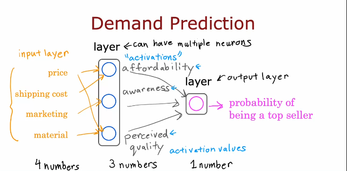
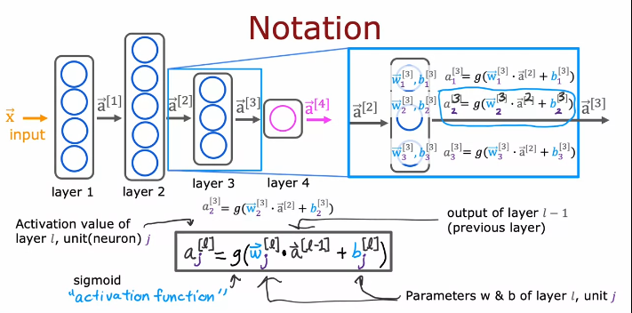

# Advanced Learning Algorithms

- Content:
    - Neural Networks
        - Inferencing from existing NN
        - Training your own
    - Practical advice for machine learning
    - Decision Trees

# Neural Network

> Algorithms that try to mimic the brain. Started 1980s and resurrected from around 2005

- Now, NN is nothing like brain but early motivation was from that.

- Neurons in the brain
    - Cell body 
        - neucleus (processing portion)
        - Dendrides (Input wire)
        - Axon (output wire)

- NNs are famous now due to increase inn amount of data.
    - Also, the computational power has increased
    - Traditional ML algorithms' performance pleateus(ie. doesn't give appreciable return on increase in data) but larger the NN, more data is better.

## Neural Network Intuition with Demand Production

- Suppose, you have price of t-shirt(input feature) and top seller or not (output)

- Suppose a neuron is sigmoid function.
    - A single neuron can be thought of like a small processor.

- Now, suppose we have four input features (price, shipping cost, marketing, material)

- We create layers, with each layer no. of neurons decrease i.e. we reduce no. of input for next layer.



## Recognizing Images

- Consider a grayscale picture
- Image as a 2D vector (with pixel intensity values)

> With each layer, higher level details are detected.(lines, curves... in first layer, eye in second, face shape in third and so on ... for example)

## Neural Network layer

> For each layer, input is some value and output is a activation value vector. (Output of simoid function applied to w*(input vector) + b)

- At last layer, you might threshold it if binary classification.

## More complex neural network

> When we say n layers, it included all hidden layers but not input layers.



- Notation:
    - Superscript denotes layer number
    - Subscript denote neuron number (for that layer).

## Inference in Code

- Coffee roasting example. (Properly cooked or not based on time and temperature)
```py
x = np.array([[200.0, 17.0]]) # Feature vector - array of two numbers
layer_1 = Dense(units=3, activation='sigmoid') # layer1 with 3 hidden units and sigmoid activation
a1 = layer_1(x) # output of layer1
# If you print a1, you will get a tf.Tensor([[0.2 0.7 0.3]], shape=(1,3), dtype=float32) -- Think of tensor as more efficient matrix

# You can use a2.numpy() to typecast it to numpy matrix
layer_2 = Dense(units=1, activation='sigmoid') # layer2
a2 = layer_2(a1) # Applying layer1

if a2 >= 0.5:
    yhat = 1
else:
    y_hat = 0
```

- That is how you inference. (Some parts are ignored here)

## Data in tensorflow

> There are some inconsistency in tf and numpy

```py
# consider this(that is used above):
x = np.array([[200.0, 17.0]]) # this is "2d" matrix

x = np.aray([200, 17]) # this is 1d "vector"

# Tensor flow works with matrix not vector
```

## Building a neural network architecture

```py
layer_1 = Dense(units=3, activation="sigmoid")
layer_2 = Dense(units=1, activation="sigmoid")

modl = Sequential([layer_1, layer_2]) # this combines layers to make a model

x = np.array([......]) # features

y = np.array([....]) # targets

model.compile(...some parameters here...) # Building model
model.fit(x,y) # Training

model.predict(x_new) # Inference
```

## Forward propagation

```py
x = np.array([200, 17])

# Let
w1_1 = np.array([1,2])
b1_1 = np.array([-1])
z1_1 = np.dot(w1_1, x)+ b1_1
a1_1 = sigmoid(z1_1)

# similarly compute a1_2
# similary for others....

# Now for a1,

a1 = np.array([a1_1, a1_2, a1_3]) #output from layer 1

# Similarly for a1

# using w2_1(1*3) and b2_1 calculate z2_1
```

## General implementation of forward propagation

```py
W = np.array([
    [1, -3, 5]
    [2, 4, -6]
])

b = np.array([-1, 1, 2])

a_in = np.array([-2, 4])
```

- Code looks like this:
```py
def dense(a_in, W, b):
    units = W.shape[1]
    a_out = np.zeros(units)
    for j in range(units):
        w = W[:,j]
        z = np.dot(w,a_in) + b[j]
        a_out[j] = g(z) #g() is sigmoid
    return a_out
```

- Now sequential:
```py
def sequential(x):
    a1 = dense(x, W1, b1)
    a2 = dense(a1, W2, b2)
    a3 = dense(a2, W3, b3)
    a4 = dense(a3, W4, b4)
    f_x = a4
    return f_x
```

## How neural networks are implemented efficiently

> Vectorization is the way

```py
import numpy as np
C = np.matmul(A, B) # this can efficiently multiply matrix
```

- You can multiply a_transpose and w to get dot product
```py
# matrix is just different vectors stacked in column

a = np.array([[1, -1, 0.1],
    [2, -2, 0.2]])
a_t = a.t # this is weird

w = np.array([[3,5,7,9],
        [4,6,8,0]]
)

z = np.matmul(AT, W)

# or z = a @ w works as well
```

- Dense layer vectorization
```py
def dense(AT, w, b)
    z = np.matmul(AT, w) + b
    a_out = g(z)
    return a_out
```