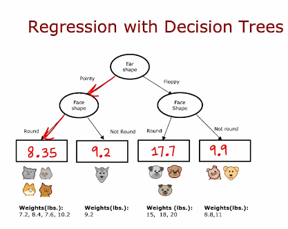

# Decision Tree

# Decision Tree

- Consider a Cat classification problem.
    - Given ear shape(pointy, floppy), face shape(round, not_round), whisker(bool)

- Leaf node make prediction, you start from root node and take paths based on value of features.

- Decisions we make:
    - How to choose what feature to split on at each node?
        - To maximize purity (or minimize impurity)
    - When to stop splitting?
        - When a node is 100% one class
        - When splitting a node will result in the tree exceeding a maximum depth

## Entropy

- Entropy is a measure of impurity.

- For the same cat classification.
    - If its 50/50 cat/no_cat => entropy = 1
    - If all cat => entropy = 0
    - If all no_cat => entropy = 0

- Equation:
    - p1 = fraction of examples that are cats
    - p0 = 1 - p1 = fraction of examples that are not cat
    - H(p1) = -p1.log2(p1) - p0.log2(p0)
            = -p1.log2(p1) - (1-p1).log2(1-p1)
    - 0log(0) is taken as 0

- Information Gain:
> Information gain is reduction in entropy.
    - If we split using:
        - Ear shape: 4/5 cat on left(ideally 5/5) and 1/5 cat on right(ideally 0/5). => Entropy = 0.72 on left and 0.72 on right
        - Face shape: 0.99 and 0.92
        - Whiskers: 0.81 and 0.92
    - If we take weighted entropy of left and right subbranch:
        - n1*H(p1) + n2*H(p2)
    - But instead of using this, we use reduction in entropy if we didn't split:
        - i.e. H(parent) - (n1*H(p1) + n2*H(p2))
        - This is called information gain
        - Ear shape: 0.28
        - Face shape: 0.03
        - Whiskers: 0.12

- We can decide on whether to continue splitting or not based on value of information gain. If too small, we stop.

## Putting decision tree together

- Start with root node
- Calculate information gain for all possible feature and choose the one with highest infromation gain
- Split dataset and create branch
- Keep repeating until:
    - When node is 100% one class
    - Exceeds maximum length
    - Information gain is less than threshold
    - When number of examples in a node is below threshold.

## One hot encoding:

- If features can have more possible values, you can use one hot encoding.

- Instead of using feature that can have 3 different value, we create three new features.
    - i.e. instead of using Ear shape with floppy, pointy and oval we can use Floppy, Pointy and oval features with binary value.(0 or 1)

## Continuous value feature:

- In this case we introduce threshold.
- Try different value of threshold, and choose one with max. information gain.

## Regression Trees:

- We can use this to predict number. 
- Leaf can have average value.



- How to split:
    - Calculate variance and use weighted average of variance instead of entropy.

## Tree Ensemble: Using multiple decision trees

> Trees are highly sensitive to small changes of the data.

- Just changing one example might change the split and result in different decision tree.
- You could use multiple trees: Tree ensemble.

## Sampling with Replacement to create Tree ensemble.

- You create multiple samples. If you don't replace, you get same value each time.
- Your sample is of exact same size as the total number of examples.

- You could pick a random subseet of k < n features and allow the algorithm to only choose from that subset of features. Mostly k is taken squareroot of n.

- Then you create multiple decision trees => **Random Forest Algorithm**

## Boosted tree

> While building next decision tree in ensemble, we focus more on misclassified examples.

## XGBoost (eXtreme Gradient Boosting)

- Open source implementation of boosted trees
- Fast efficient implementation
- Good choice of default splitting criteria and criteria for when to stop splitting
- Built in regularization to prevent overfitting
- Highly competitive algorithm for machine learning competitions.

- For Classification
```py
from xgboost import XGBClassifier

model = XGBClassifier()
model.fit(X_train, y_train)
y_pred = model.predict(X_test)
```

- For regression
```py
from xgboost import XGBRegressor

model = XGBRegressor()
model.fit(X_train, y_train)
y_pred = model.predict(X_test)
```

## When to use decision trees?

- Decision trees and Tree ensembles:
    - work well on tabular(structured) data
    - Not recommended for unstructured data (images, audio, text)
    - Fast (mostly training)
    - Small decision trees may be human interpretable

- Neural networks:
    - works well on all type of data, including tabular and unstructured data
    - may be slower than a decision tree
    - Works with transfer learning
    - It might be easier to string together multiple neural networks.