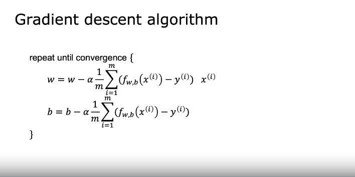

# Machine Learning

> Getting computers to learn without explicit programming.

## Supervised Learning

> They learn X -> Y mappings. i.e. Predicts output label for input

> * Try housing price prediction using regression. *

- Regression problem: Infinitely many possible outputs.
- Classification problem: Finite number of output(classes or categories).

- These sounds fun. 
    - Train a ML model to predict sum of two numbers.
    - Classification odd or even.

## Unsupervised Learning

> There isn't a output label. Find something interesting in unlabeled data. (For eg. Clustering)

- Think of google news as example
- Anomaly detection
- Dimenesionality reduction

## Linear Regression Model

- One model that addresses regression model

- Terminology:
    - Training set: data used to train the model
        - x for input, y for output or target variable
        - m for number of training examples
        - (x(i), y(i)) for single specific training example

- Process of Supervised learning:
    - Training set has features and targets
    - Learning algorithm produces some function `f` (also called hypothesis)
        - This function should be able to predict `ŷ`
    - A problem is how to represent `f`:
        - Consider fw,b(x) = wx+b or f(x) = wx+b. This is linear function. This is univariate linear regression as a single variable(x) is used.
    
- Linear regression model representation

### Notation
Here is a summary of some of the notation you will encounter.   

| General Notation | Description | Python (if applicable) |
|:-----------------|:------------|:-----------------------|
| $a$ | scalar, non bold | |
| $\mathbf{a}$ | vector, bold | |
| **Regression** |  |  |
| $\mathbf{x}$ | Training Example feature values (in this lab - Size (1000 sqft)) | `x_train` |
| $\mathbf{y}$ | Training Example targets (in this lab Price (1000s of dollars)) | `y_train` |
| $x^{(i)}$, $y^{(i)}$ | $i_{th}$ Training Example | `x_i`, `y_i` |
| m | Number of training examples | `m` |
| $w$ | parameter: weight | `w` |
| $b$ | parameter: bias | `b` |
| $f_{w,b}(x^{(i)})$ | The result of the model evaluation at $x^{(i)}$ parameterized by $w,b$: $f_{w,b}(x^{(i)}) = wx^{(i)}+b$ | `f_wb` |

- Cost Function:
    - In example above, w and b are parameters
    - Parameters are variables you can adjust during training to improve the model.

    - w controls rate of change of output wrt input
    - b can move the line up or down. It is kind of like the base output. i.e. output when input is 0.

    - Our goal is to make prediction close to original value.
    - Cost Function (Mean Squared Error, MSE):
        - $J(w, b) = \frac{1}{2m} \sum_{i=1}^{m} (f_{w,b}(x^{(i)}) - y^{(i)})^2$
        - Here division by 2 just makes calculation later easier.
        - Squared Error cost function is widely used for regression problems.
    - To build intuition, lets fix b to 0 and change w, by changing w and calculating J, you can plot and get a parabola. Pick a w to minimize J.
    - If you plot J(w,b), you get a 3D bowl like thing.

## Gradient Descent

> Using derivative at the point to minimize the cost

- Taking steps along the direction with highest gradient.
- You might end up at different minimum (local minimum) depending on initial value.

### Implementing Gradient descent algorithm

- Update rule for gradient descent:
    $$
    w := w - \alpha \frac{\partial J(w, b)}{\partial w}
    $$
    $$
    b := b - \alpha \frac{\partial J(w, b)}{\partial w}
    $$
- Here alpha is learning rate.

- Simultaneous update for gradient descent:
    $$
    \text{temp}_w := w - \alpha \frac{\partial J(w, b)}{\partial w}
    $$
    $$
    \text{temp}_b := b - \alpha \frac{\partial J(w, b)}{\partial b}
    $$
    $$
    w := \text{temp}_w
    $$
    $$
    b := \text{temp}_b
    $$

- Gradient descent is always implemented in simultaneous update form. It works better.

### Choosing Learning Rate

- If α is too small, gradient descent may be slow.
- If α is too large, gradient descent may overshoot and fail to converge(may even diverge)

- If you are at local minima, derivative is 0 so the formula doesn't update the parameters.
- Whereever you start, with fixed learning rate, the gradient and hence the amount of change of parameter will decrease as you approach the minima.

### Batch Gradient descent

> Each step of gradient descent uses all the training examples.
