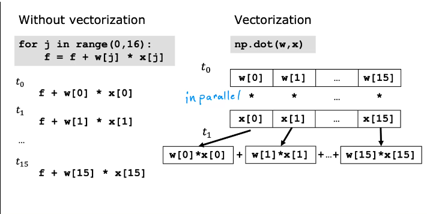

# Machine Learning

> Getting computers to learn without explicit programming.

## Supervised Learning

> They learn X -> Y mappings. i.e. Predicts output label for input

> * Try housing price prediction using regression. *

- Regression problem: Infinitely many possible outputs.
- Classification problem: Finite number of output(classes or categories).

- These sounds fun. 
    - Train a ML model to predict sum of two numbers.
    - Classification odd or even.

## Unsupervised Learning

> There isn't a output label. Find something interesting in unlabeled data. (For eg. Clustering)

- Think of google news as example
- Anomaly detection
- Dimenesionality reduction

## Linear Regression Model

- One model that addresses regression model

- Terminology:
    - Training set: data used to train the model
        - x for input, y for output or target variable
        - m for number of training examples
        - (x<sup>(i)</sup>, y<sup>(i)</sup>) for single specific training example

- Process of Supervised learning:
    - Training set has features and targets
    - Learning algorithm produces some function `f` (also called hypothesis)
        - This function should be able to predict `ŷ`
    - A problem is how to represent `f`:
        - Consider f<sub>w,b</sub>(x) = wx+b or f(x) = wx+b. This is linear function. This is univariate linear regression as a single variable(x) is used.
    
- Linear regression model representation

### Notation
Here is a summary of some of the notation you will encounter.   

| General Notation | Description | Python (if applicable) |
|:-----------------|:------------|:-----------------------|
| $a$ | scalar, non bold | |
| $\mathbf{a}$ | vector, bold | |
| **Regression** |  |  |
| $\mathbf{x}$ | Training Example feature values (in this lab - Size (1000 sqft)) | `x_train` |
| $\mathbf{y}$ | Training Example targets (in this lab Price (1000s of dollars)) | `y_train` |
| $x^{(i)}$, $y^{(i)}$ | $i_{th}$ Training Example | `x_i`, `y_i` |
| m | Number of training examples | `m` |
| $w$ | parameter: weight | `w` |
| $b$ | parameter: bias | `b` |
| $f_{w,b}(x^{(i)})$ | The result of the model evaluation at $x^{(i)}$ parameterized by $w,b$: $f_{w,b}(x^{(i)}) = wx^{(i)}+b$ | `f_wb` |

- Cost Function:
    - In example above, w and b are parameters
    - Parameters are variables you can adjust during training to improve the model.

    - w controls rate of change of output wrt input
    - b can move the line up or down. It is kind of like the base output. i.e. output when input is 0.

    - Our goal is to make prediction close to original value.
    - Cost Function (Mean Squared Error, MSE):
        - $J(w, b) = \frac{1}{2m} \sum_{i=1}^{m} (f_{w,b}(x^{(i)}) - y^{(i)})^2$
        - Here division by 2 just makes calculation later easier.
        - Squared Error cost function is widely used for regression problems.
    - To build intuition, lets fix b to 0 and change w, by changing w and calculating J, you can plot and get a parabola. Pick a w to minimize J.
    - If you plot J(w,b), you get a 3D bowl like thing.

## Gradient Descent

> Using derivative at the point to minimize the cost

- Taking steps along the direction with highest gradient.
- You might end up at different minimum (local minimum) depending on initial value.

### Implementing Gradient descent algorithm

- Update rule for gradient descent:
    $$
    w := w - \alpha \frac{\partial J(w, b)}{\partial w}
    $$
    $$
    b := b - \alpha \frac{\partial J(w, b)}{\partial w}
    $$
- Here alpha is learning rate.

- Simultaneous update for gradient descent:
    $$
    \text{temp}_w := w - \alpha \frac{\partial J(w, b)}{\partial w}
    $$
    $$
    \text{temp}_b := b - \alpha \frac{\partial J(w, b)}{\partial b}
    $$
    $$
    w := \text{temp}_w
    $$
    $$
    b := \text{temp}_b
    $$

- Gradient descent is always implemented in simultaneous update form. It works better.

### Choosing Learning Rate

- If α is too small, gradient descent may be slow.
- If α is too large, gradient descent may overshoot and fail to converge(may even diverge)

- If you are at local minima, derivative is 0 so the formula doesn't update the parameters.
- Whereever you start, with fixed learning rate, the gradient and hence the amount of change of parameter will decrease as you approach the minima.


### Batch Gradient descent

> Each step of gradient descent uses all the training examples.

## Multiple Linear Regression

> If the output depends on multiple values
$$
\vec{x} = [x_1, x_2, x_3, \ldots, x_n]
$$

$$
f(x) = w_1x_1 + w_2x_2 + w_3x_3 + \ldots + w_nx_n + b
$$

- This can be written as:
$$
f(\vec{x}) = \vec{w}.\vec{x} + b
$$

## Vectorization

> It makes more efficient and shorter code.

```py
w = np.array([1.0, 2.5, -3.3])
b = 4
x = np.array([10, 20, 30])
```
- Method 1:
```py
f = w[0]*x[0] + w[1]*x[1] + w[2]*x[2] + b
```

- Method 2:
```py
f = 0
for j in range(0, n):
    f = f + w[j]*x[j]
f = f + b
```

- Method 3: **Vectorization**

```py
f = np.dot(w,x) + b # Faster as it can use parallelization
```



## Gradient Descent with Vectorization

To perform gradient descent with vectorization, the update rules for the parameters w_j (weight vector) and b (bias) are as follows:


- Repeat until convergence:
    $$
    w_j := w_j - \alpha \frac{\partial J}{\partial w_j} \\
    b := b - \alpha \frac{\partial J}{\partial b}
    $$

- Update rule for multiple regression:
    $$
    w_j := w_j - \alpha \sum_{i=1}^{m} \left( h_\theta(x^{(i)}) - y^{(i)} \right) x_j^{(i)}
    $$

    $$
    b := b - \alpha \sum_{i=1}^{m} \left( h_\theta(x^{(i)}) - y^{(i)} \right)
    $$

## Normal equation

- Can be used for linear regression
- Can solvee for w, b without iteration

- But this doesn't generalize to other learning algorithm
- Slow when number of features is large.
- Might be used in some ML libraries.

## Feature Scaling

- Consider house prediction,
    - Size(sq. feet) is in large range(300 - 2000)
    - No. of bedrooms is in small range(0-5)
    - A good algorithm will choose smaller weight for large values and larger for smaller values. (Based on effect too)

- If you scale the features, (between 0 and 1 perhaps)
    - comparable range of values => Faster gradient descent.

- Options:
    - Dividing by max value
    - Mean normalization: Subtract the mean and divide by difference(between max and min)
    - Z-score normalization: subtract mean and divide by standard deviation

## Checking Gradient descent for convergence

- Plot J vs Iteration
    - This curve is called learning curve
    - J should decrease with each iteration
        - Else learning rate might not be good
    - After some iterations, it starts decreasing very slowly
        - Iterations needed might vary
    - If the curve is wavy or increasing:
        - Buggy code or learning rate is too large
        - Check by using very small alpha, if that doesn't work maybe the code is buggy

- Automatic convergence test:
    - Set a epsilon: around 0.001
    - If J decreses by less than epsilon stop.
    - Choosing appropriate epsilon is hard

## Feature Engineering

> Creating new feature from existing ones.

## Classification Problems

> Associating value(or values) with class/category.

- Binary classification => Two classes (yes/no, true/false, positive/negative)

- Linear regression doesn't work as it gives continuous value.
    - But you could say if y > 0.5 => class 1 and class 2 if y <= 0.5
    - Not a good idea as adding  single value can change the regression line and classification by a lot.

- Types:
    - Spam classification
    - Is transaction fraudulent?
    - Is tumor malignant?

## Logistic regression

- Sigmoid/Logistic function:
    - outputs values between 0 and 1
    - The sigmoid function \(g(z)\) is defined as:
        $$
        g(z) = \frac{1}{1 + e^{-z}}
        $$
        where \(0 < g(z) < 1\).
    - When z is very large +ve no. => g(z) tends to 1
    - When z is very large -ve no. => g(z) tends to 0
    - passes vertical axis at 0.5

- Steps:
    - Compute = z = w.x + b
    - f(x) = g(z)

- Interpreting the logistic regression output
    - Think of output as probability that class is 1
    - If output is 0.7, then there is 70% chance that class is 1.

> The decision boundary doesn't have to be linear as above.

- You can change expression of z to sth like quadratic, circular, elliptical, and even sinusoidal

- Logistic Regression Loss Function:
    $$
    J(\theta) = -\frac{1}{m} \sum_{i=1}^{m} [y^{(i)} \log(h_\theta(x^{(i)})) + (1 - y^{(i)}) \log(1 - h_\theta(x^{(i)}))]
    $$

## Cost function of Logistic regression

- Squared error function
    - Gives non-convex cost function
- Logistic log function

- Logistic Regression Loss Function for individual examples:
    $$
    \text{Cost}(h_\theta(x^{(i)}), y^{(i)}) = 
    \begin{cases} 
    -\log(h_\theta(x^{(i)})) & \text{if } y^{(i)} = 1 \\
    -\log(1 - h_\theta(x^{(i)})) & \text{if } y^{(i)} = 0
    \end{cases}
    $$


## Gradient descent

> Similar to that of linear regression. Lets look at code later.

## Overfitting, Underfitting 

> Underfit => model has high bias and doesn't fit the training set very well.

> Overfit => Fits the training set extremely well but doesn't generalize to new unseen data. High variance(a little change in training data will result in totally different model).

> Generalization => fit training set pretty well and predicts correctly for unseen data 

## Addressing overfitting

- Select features to include/exclude (feature selection)
    - features with insufficient data
    - irrelevant data

- Reguralization:
    - Keep the features but reduce their weight(effect)

- Collect more data

## Cost function with reguralization

> Penalize large weights

- Linear Regression Cost Function with L2 Regularization:
    $$
    J(\theta) = \frac{1}{2m} \sum_{i=1}^{m} (h_\theta(x^{(i)}) - y^{(i)})^2 + \frac{\lambda}{2m} \sum_{j=1}^{n} \theta_j^2
    $$

- Logistic Regression Cost Function with L2 Regularization:
    $$
    J(\theta) = -\frac{1}{m} \sum_{i=1}^{m} [y^{(i)} \log(h_\theta(x^{(i)})) + (1 - y^{(i)}) \log(1 - h_\theta(x^{(i)}))] + \frac{\lambda}{2m} \sum_{j=1}^{n} \theta_j^2
    $$

- where `lambda` is regularization parameter
    - If super large, underfit
    - If super small, overfit (like not having regularization)

