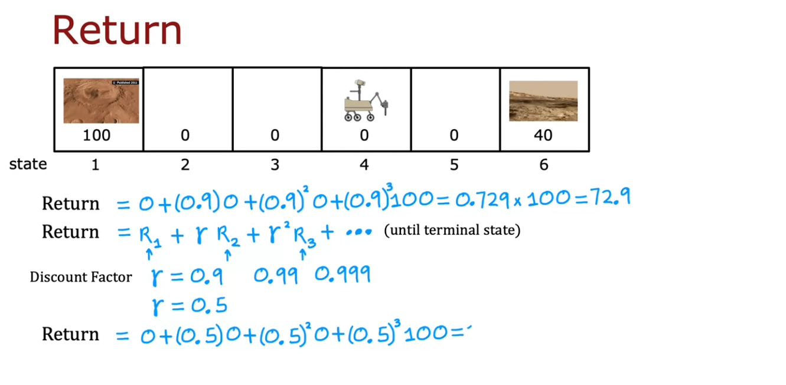
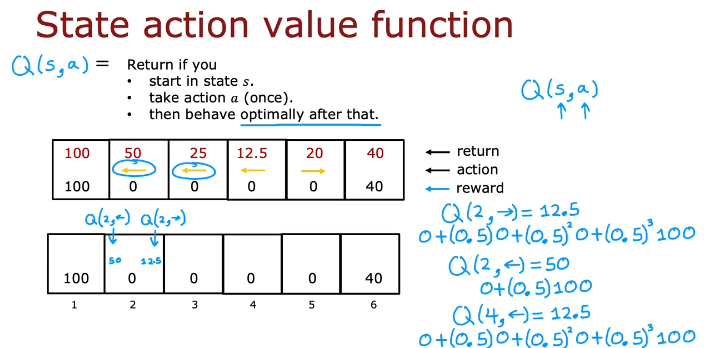
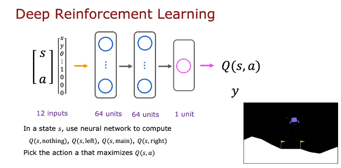

# Reinforcement learning

> A reward function tell the algorithm if it is doing well or not. The algorithm will try to get more reward.

- Application:
    - Controlling robots
    - Factory optimization
    - Financial training
    - Playing games

## Return
- Reward and discount factor to get return

## Policy
- Policies:
    - Closest reward
    - Max reward
    - Always left unless reward just at right
- Policy is a function that gives action.
- Goal is to find policy that maximizes the return.

## Markov Decision Process (MDP)

> Future only depends on current state and not on the process that got you there.

## State action value function

> Q(S,a) i.e function of state and action.

- Return(as describeed above) if you
    - start in state s
    - take action a (once)
    - then behave optimally after that.

- But how do you know the behavior is optimal after that? Isn't that circular?

> Once you know Q value, you can pick actions.

## Bellman Equation

> Helps calculate Q function

- Notation:
    - s : current state
    - R(s) : reward of current state
    - a : current action
    - s' : action that you take in state s'

- Q(s,a) = R(s) + γ maxQ(s',a')
    - Reward you gate right away + return from behaving optimally starting from state s'

## Stochastic Environment

> Environment which has chances of ending up in unintended state. (Consider robot on messed up ground)

## Continuous state space

> There are not discrete set of states in most applications.

- state is vector of some variables that can take infinite number of values. (position and orientation)

- Consider lunar lander with:
    - action:
        - do nothing
        - left thruster
        - main thruster
        - right thruster
    - state will have:
        - position
        - linear velocities
        - orientation
        - angular velocitites
    - Reward function:
        - Getting to landing pad: 100 to 140
        - Additional reward for moving towards/away from pad
        - ...

- Pick actions to maximize the return

> This with Bellman equation is Deep Q N.

## Epsilon greedy policy

> While still learning, how to choose actions?

- Most of the time, pick action that maximizes Q(s,a). Maybe 95%
- sometimes, pick an random a randomly. Maybe 5% (0.05 is epsilon)

- Greedy + exploration

> Other refinements are mini-batch and soft updates.