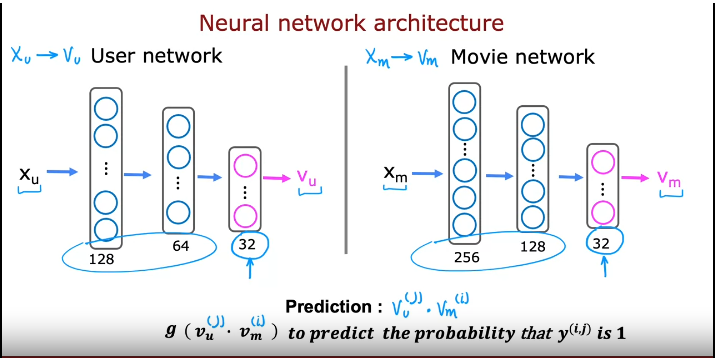
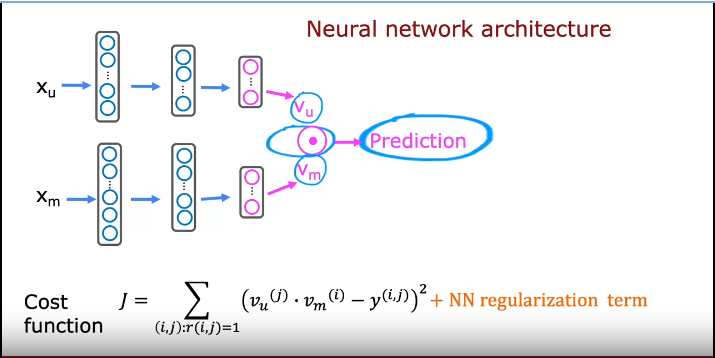

# Unsupervised learning

> Working with unlabelled dataset.

## Beyond Supervised learning:

- Unsupervised Learning:
    - Clustering
    - Anamaly detection
- Recommendation Systems
- Reinforcement Learning

# Clustering

> Grouping inputs based on similarity

- Applications:
    - Market segmentation
    - Grouping similar news
    - DNA analysis
    - Astronomical data analysis

## K-means clustering

- Steps:
    - Decide on two random points i.e. cluster centroids (if you want two clusters)
    - Repeat:
        - For each point, check if the point is closer to cluster centroid 1 or cluster centroid 2.
        - The for each points closer to centroid 1, take average of the value and find new centroid. Do same for other centroids.

- Randomly initializing K cluster centroids
- Repeat {
    - Assign points to cluster centroids
        - for i = 1 to m:
            - c(i) := index (from 1 to K) of cluster closest to x(i)
    - Move cluster centroids:
        - for k = 1 to K
            m(k) := average(mean) of points assigned to cluster k
}

- Optimization objective:

$$ 
J = 1/m \sum_{i=1}^{m} \mathbb \| x^{(i)} - \mu_c{(i)} \|^2
$$

- where, mu_c is the cluster centroid to which example x(i) has been assigned.

- How to initialize:
    - choose K < m (no. of clusters < no. of training example)
    - Randomly pick K training examples and get their mean and use that as cluster centroid.
> This might result in getting stuck at local minima.

- Another way:
    - Run with different initializattion and use the option with smallest cost function
    - For i = 1 to 100 {
        - Randomly initialize k-mmeans
        - Run k means
        - Compute cost functions
    }
    - Pick set of clusters that gave lowest cost J

- Choosing the number of clusters:
    - You don't have the unambiguous answer.
    - Methods:
        - Elbow method:
            - Run with various values of k and chose the value where the rate of decrease of cost function is low.
            - This is ambiguous a lot of time.
        - Evaluate k-means based on how well it performs on the later purpose.

## Anomaly detection

- Technique: Density estimation
    - Find region with high probability
    - Find region with low probability
    - Then you calculate prob. of the test data
        - And based on likeliness, decide.

- Example: Fraud detection
    - Often additional checks(manual) is performed after detection

### Gaussian (normal) distribution
- Probability of x is determied by a Gaussian with mean(μ) and standard deviation(σ)

- bell shaped curve
- Only works for just 1 number

### Anomaly detection algorithm (build upon Normal distribution)

- Consider n features:
    - probability of a feature vector is product of probability of each feature based on mean(μ) and standard deviation(σ)
        - This looks like this assumes independence but works for independent as well   
        - You need to calculate mean and standard deviation requried
- When a new test example come, you calculate probability and if it is less than or greater than (ε). (Which is reasonable probability)

### Developing and evaluating anomaly detection system

- Assume some labeled data of anomalous and non-anomalous examples: labeled y=0 and y=1
    - For all training examples, assume non-anomalous
    - Then cross validationa and test test with at least a few anomalous examples
    - Tune epsilon using cross validation set
    - Then use test set to test
> Often people use just train and cv sets

- Evaluation :
    - Fit model on training set
    - ON cv/test set, predict:
        - y = 0 or 1
    - This is often skewed (low anomalies)
    - Possible evaluation metrics:
        - Precision, recall, f-1 score
    
## Anomaly detection Vs supervised learning

- If you have some labelled test and cv sets, why not use supervised learning
- If very small number of labelled examples and there are different types of anomalies, anomaly detection might be better.
- If you dont have many types of anomaly (like spam detection), supervised learning might be better. Often if you have large enough data.

## Choosing what features to use

- More important in anomaly detection than in supervised learning
- Try to use more or less gausian features
    - If non-gaussian: 
        - You can reduce skewness using log transform.
        - Others also work log(x + c)

- Error analysis:
    - p(x) is comparable for normal and anomalous examples

- You can use vectorization to calculate mean, standard deviation, precision, recall, F1 score etc. 

# Recommender systems

## Collaborative filtering
- Consider predicting movie ratings
    - Suppose there are m movies and n users.
    - Not every user rates all movies.
    - Suppose we have set of features for both movies.
        - For each user based on those set of features, predict rating. (Just linear regression)
            - Cost function is just mean squared error.
    - If you don't have access for those set of features    
        - You come up with features x1 and x2.., assume w and b
        - To learn x(i) for movie i, so that for all users that have rated movie i, difference is minimized. (mean squared error)
        - For m, movies sum the diffrence above.
        - You add cost function for w,b and for x1 and x2 together to get cost function.
        - i.e. Cost function is function of w, b and x.
        - You can use Gradient descent but with three parameters now.
    
## Binary labels: favs, likes and clicks

- Consider online shopping.
    - Label could denote if user purchased after being shown item.
        - if user fav/like item
        - if spend at least 30s in item description.
    - Here we can predict y based on w,x and b.
        - Using sigmoid perhaps
    - Loss becomes Binary Cross entropy loss

## Mean Normalization

- Take all ratings and calculate average for each movie to get mean vector.
- Then substract the mean from each rating of movie.
- Then w.x+b+mean is used instead of w.x+b

- It helps algorithm run faster and perform better.

## Tensorflow for collaborative filtering

- Custom training loop with auto diff auto grad
```py
w = tf.Variable(3.0)
x = 1.0
y = 1.0 #target value
alpha = 0.01

iteration = 30
for iter in range(iterations):
    with tf.GradientTape() as tape:
        fwb = w*x
        costJ = (fwb-y)**2
    
    [dJdw] = tape.gradient(costJ, [w])

    w.assign_add(-alpha * dJdw) #tf variables require special function to modify
```

- Implementation

```py
optimizer = keras.optimizers.Adam(learning_rate=1e-1)

iterations = 200
for iter in range(iterations):

    with tf.GradientTape() as tape:
        cost_value = cofiCostFuncV(X,W,b,Ynorm, R, num_users, num_movies, lambda)
    
    grads = tape.gradient( cost_value, [X,W,b])

    optimizer.apply_gradients(zip(grade, [X, W, b]))
```

## Limitations of Collaborative Filtering

- Cold start problem. How to
    - rank new items that few users have rated?
    - show something reasonable to new users who have rated few items?

- Use side/additional information about items or users:
    - Item: Genre, movie stars, studio ...
    - User: Demographics, expressed preferrence

## Content-based filtering

> Recommend items to you based on features of user and item to find a good match

now instead of w.x+b we use v(u).v(m) wjere v(u) is user vector and v(m) is movie vector.

## Deep learning for content based filtering




> Recommendations can be *calculated* ahead of time

## Recommending from a large catalogue

- Two steps:
    - Retrieval:
        - Generate large list of plausible item candidates
        - Combine retrieved items into list, remove duplicates and already watched/purchased items
    - Ranking:
        - Take list retrieved and rank using learned model
        - Display ranked items to user

- Retrieving more items => slower but better performance
    - Carry out some offline experiments to see if retrieving additional items results in more relevant recommendations.

- Goal of the recommender system:
    - Movies most likely to be rated 5* by user
    - Products most likely to be purchased
    - Ads most likely to be clicked on
    - Products generating the largest profit
    - Video leading to maximum watch time

- Ethical considerations with recommender systems
    - Watch time
    - problematic contents
    - Transparency issues

## TensorFlow implementation of content-based filtering

```py
# create the user input and point to the base network
input_user = tf.keras.layers.Input(shape=(num_user_features))
vu = user_NN(input_user)
vu = tf.linalg.12_normalize(vu, axis=1)

# create the item input and point to the base network
input_item = tf.keras.layers.Input(shape=(num_user_features))
vm = user_NN(input_item)
vm = tf.linalg.12_normalize(vm, axis=1)

# measure the similarity of the two vector outputs
output = tf.keras.layers.Dot(axes=1)([vu, vm])

# specify the inputs and output of the model
model = Model([input_user, input_item], output)

# specify the cost funciton
cost = tf.keras.losses.MeanSquaredError()

user_NN = tf.keras.models.Sequential([
    tf.keras.layers.Dense(256, activation='relu'),
    tf.keras.layers.Dense(128, activation='relu'),
    tf.keras.layers.Dense(32)
])

item_NN = tf.keras.models.Sequential([
    tf.keras.layers.Dense(256, activation='relu'),
    tf.keras.layers.Dense(128, activation='relu'),
    tf.keras.layers.Dense(32)
])
```

## Principal component analysis

> Unsupervised learning algorithm

- Used for visualizing data with large no of features by reducing the number of features.

- PCA with more or less automatically choose some features(choose just one axis) but not just that.
- If you can't just ignore some features:
    - Combining features (creating new axis that corresponds to points of two features) to get new feature
        - Eg. combining height and length to get new variable size