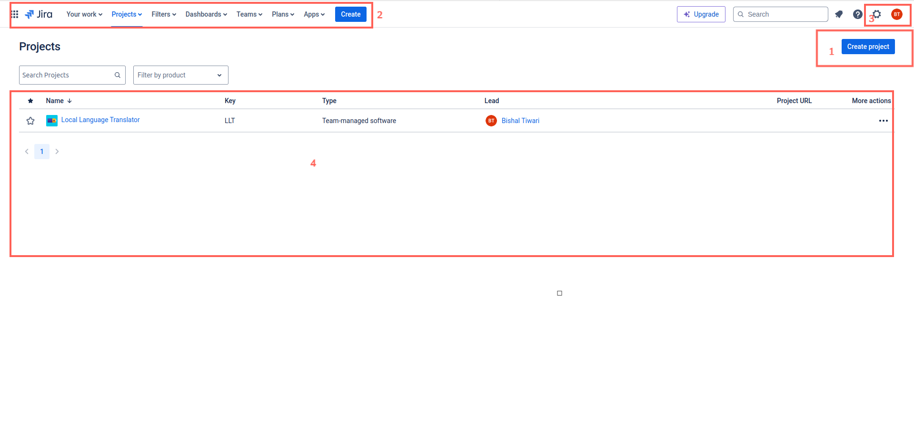
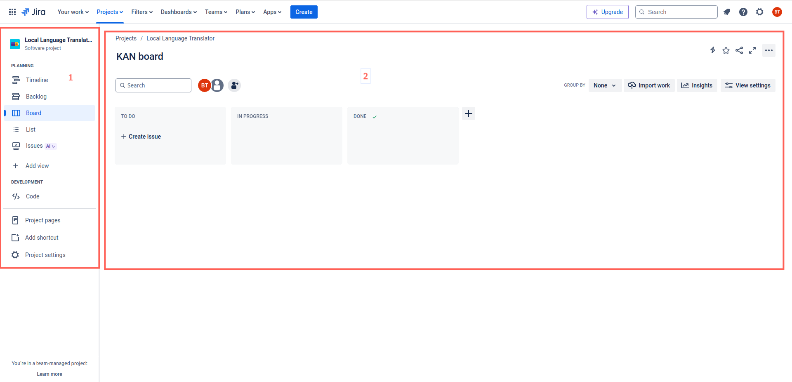
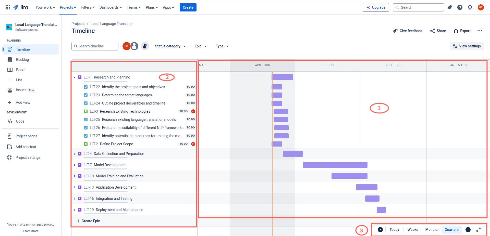
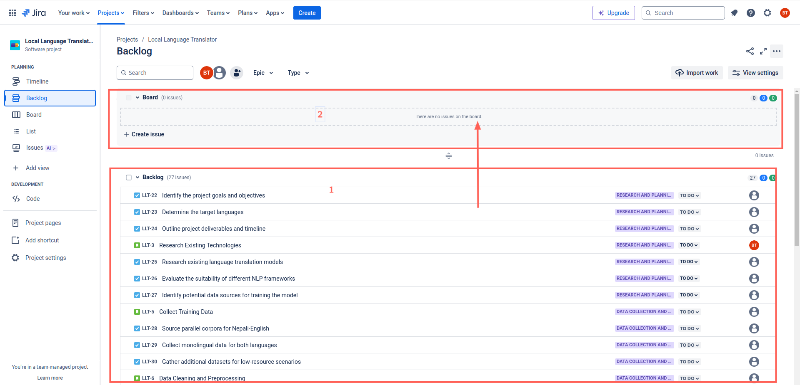
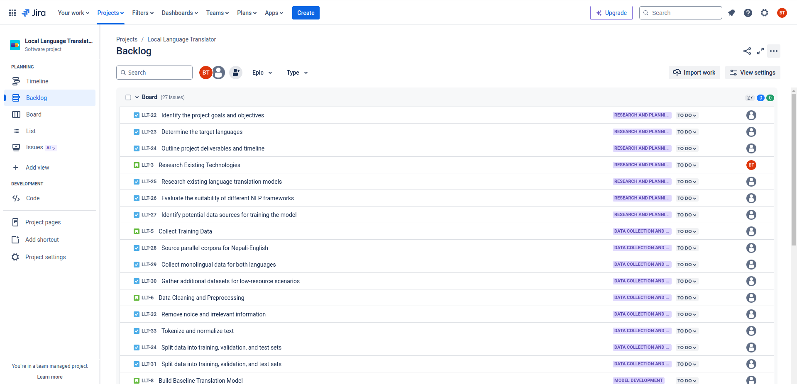
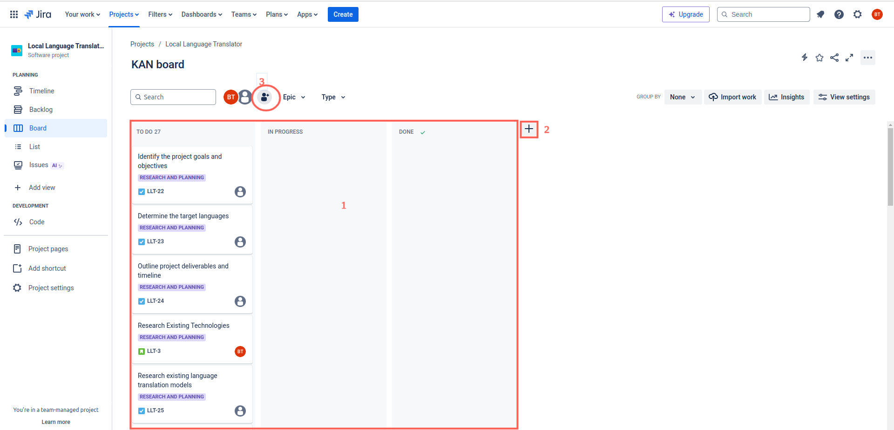
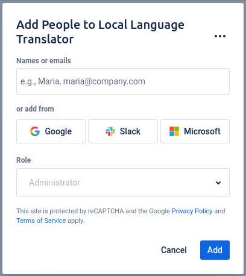
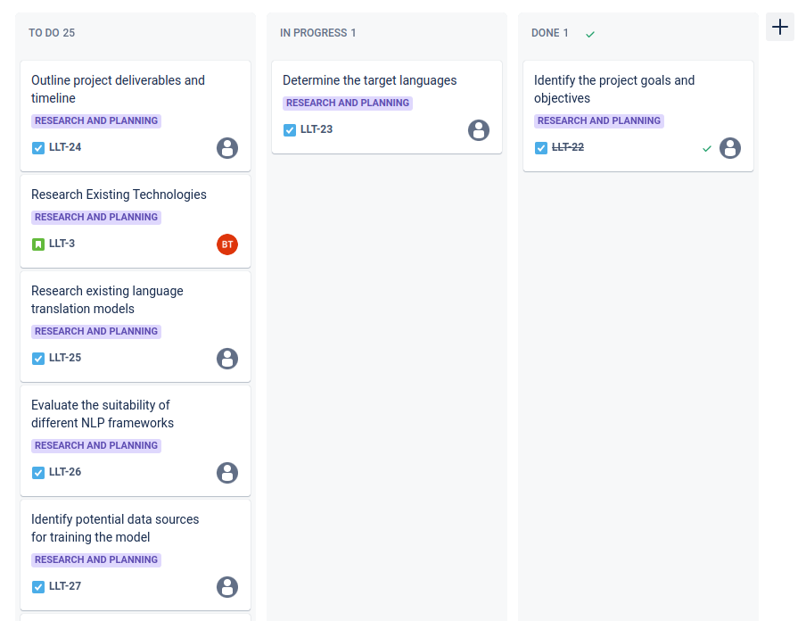

<h1> Project Management Tools Documentation</h1> 

## Bishal Tiwari
## 2024-05-30

---

# Table of Contents

1. [Project Management Tools](#project-management-tools)
    - What are Project Management Tools?
    - Key Features of Project Management Tools
    - Popular Project Management Tools
2. [Software Development Life Cycle (SDLC)](#software-development-life-cycle-sdlc)
    - What is SDLC?
    - Phases of SDLC
    - Some Models of SDLC
    - Importance of SDLC
3. [Jira - UI](#jira---ui)
4. [Jira - Project View](#jira---project-view)
5. [Jira - Timeline](#jira---timeline)
6. [Showing issues in board](#showing-issues-in-board)
7. [Jira - Board](#jira---board)

---

# Project Managemenet Tools

### What are Project Management Tools?

Project management tools are software applications designed to assist in the planning, organizing, and managing of project tasks and resources. These tools help teams collaborate, track progress, and achieve project goals efficiently. They are essential for ensuring projects are completed on time, within scope, and within budget.

### Key Features of Project Management Tools

1. **Task Management**: Assign, track, and manage tasks and subtasks.
2. **Time Management**: Schedule tasks, set deadlines, and allocate resources.
3. **Collaboration**: Facilitate team communication and document sharing.
4. **Resource Management**: Monitor resource allocation and workload.
5. **Reporting**: Generate reports on project progress, performance, and metrics.
6. **Budget Management**: Track project costs and manage budgets.

### Popular Project Management Tools

1. **Jira**
2. **Trello**.
3. **Asana**
4. **Microsoft Project**
5. **Basecamp**

# Software Development Life Cycle (SDLC)

### What is SDLC?

The Software Development Life Cycle (SDLC) is a structured process to approach software development from idea to end of life.

### Phases of SDLC

1. **Planning**: Define the project scope, objectives, and feasibility. Develop a project plan that outlines the resources, timeline, and budget.
2. **Requirements Analysis**: Gather and analyze the functional and non-functional requirements of the software from stakeholders.
3. **Design**: Create the architecture and design of the software, including data models, interface designs, and system components.
4. **Development**: Write and compile the code to build the software application. This phase involves actual coding based on the design documents.
5. **Testing**: Validate the software to ensure it meets the required specifications. This includes unit testing, integration testing, system testing, and user acceptance testing (UAT).
6. **Deployment**: Release the software to the production environment where it will be used by end-users. This phase may include additional testing and user training.
7. **Maintenance**: Provide ongoing support, fix bugs, and implement enhancements or updates to the software.

### Some Models of SDLC

1. **Waterfall Model**: A linear and sequential approach where each phase must be completed before the next begins.
2. **Agile Model**: An iterative and incremental approach that allows for flexible and rapid delivery of software components.

### Importance of SDLC

- **Quality Assurance**
- **Project Management**
- **Risk Management**
- **Cost Management**
- **Documentation**

> By leveraging project management tools, teams can streamline their workflow, improve efficiency, and deliver high-quality software that meets user expectations.

# Jira - UI

1) Create Project Button
2) Navigation
3) Profile and setting
4) Project list

# Jira - Project View

1) Project navigation
    - Timeline: Shows events in Gantt chart.
    - Backlog: Displays a list of tasks and user stories that have not been scheduled for a specific iteration.
    - Board: Visualizes the workflow of tasks and allows for drag-and-drop task management.
    - List: Presents tasks in a list format for easy viewing and editing.
    - Issues: Provides a comprehensive view of all issues and their details.
    - Project Settings: Allows for customization and configuration of project-specific settings.

2) Working screen
    - Changes based on option selected. One shown in image is board.

> Here, the board is empty since there are no issues added.

# Jira - Timeline

1) Gantt Chart: Visual representation of time allocated for issue.
2) List of issues
    - Icons are different based on type of issue
3) Scale options for Gantt chart

> You can create new epics by using `Create Epic` button at bottom of issue list

> New story can be added using + sign that appears when hovering over a epic in the list.

> You can change the type of issue by selecting it and choosing a different type from option.

# Showing issues in board

- Even after adding issues in timeline, they don't appear in board.

1) There are issues in backlog
2) The board is empty

> To show issues in board, drag and drop issues from backlog to board

It should look like this:

- Now you will have items in your board

# Jira - Board

1) Columns: They are categories to represent current status of issues
2) Add new column
3) Add people

- You can drag and drop items between columns

