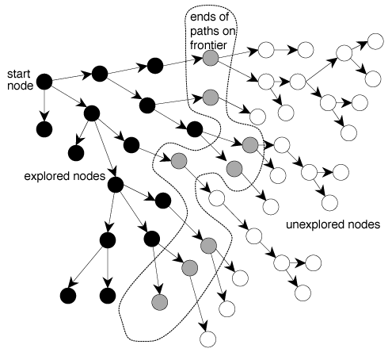
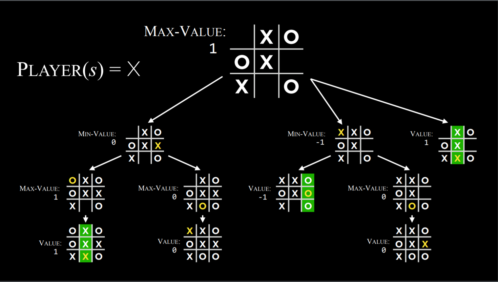
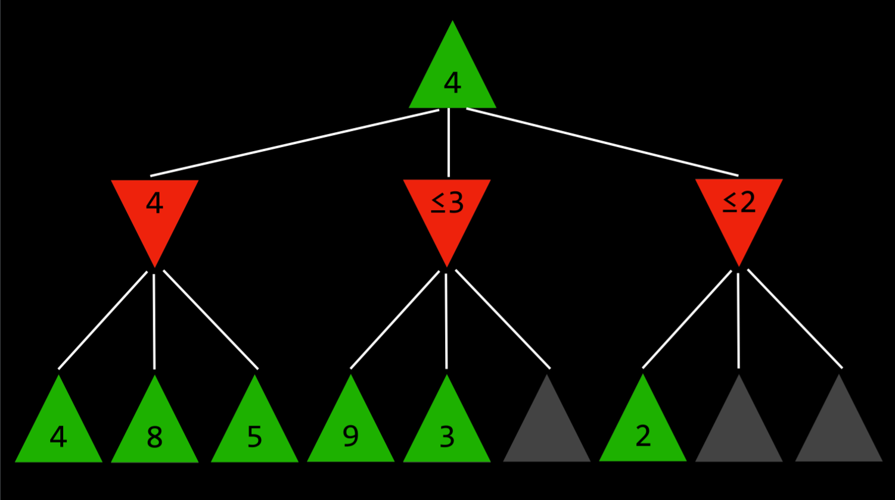

# Search

> Search problems involve and agent that is given an initial state and a goal state, and it returns a solution of how to get from former to latter.

## Definitions

- Agent: An entity that perceives its environment and acts upon that environment.

- State: A configuration of an agent in its environment. Inital state is state from which the search algorithm starts.

- Actions: Choices that can be made in a state. Actions can be defined as a function.

> Upon receiving state `s` as input, `Action(s)` returns as output the set of actions that can be executed in state `s`.

- Transition model: Description of what state results from performing any applicable action in any state. 

> Upon receiving state `s` and action `a`, Results(s,a) returns the state resulting from performing action `a` in a state `s`.

- State space set of all states reachable from the initial state by any sequence of actions.

> State space can be visualized as a directed graph with states, represented as nodes, and actions, represented as arrows between nodes.

- Goal Test: The condition that determines whether a given state is a goal state. 

- Path cost: A numerical cost associated with a given path. 

- Solution: A sequence of actions that lead from initial state to the goal state.
- Optimal Solution: A solution that has the lowest path cost among all solutions.

> In a search process,data is often represented as node, a data structure consisting of a state, parent node, action that was applied on parent to get to this node, path cost from initial state to this node.

## Generic Search Algorithm & Frontier

> Intuition: Given a graph, a set of start nodes, and a set of goal nodes, incrementally explore paths from the start nodes.

- Exploring the paths is done by maintaining a frontier(or fringe) of paths from the start node that have been explored. 



```markdown
## This is the generic algorithm
Repeat:
    1. If the frontier is empty,
        - Stop: There is no solution to the problem
    2. Remove a node from the frontier. This is the node that will be considered.
    3. If the node contains the goal state,
        - Return the solution. Stop
        else,
        ```
        - Expand the node (find all the new nodes that could be reached from this node), and add resulting nodes to the frontier.
        - Add the current node to the set of explored set.
        ```
```

> Choosing which node to remove first in Generic search algorithm gives the following few algorithms

[Search Algorithms Explained Cartoon](https://www.youtube.com/watch?v=2wM6_PuBIxY)

## Depth-First Search

> A depth-first algorithm exhausts each one direction before trying another direction. Frontier is managed as a stack data structure.

- Using stack results in a search algorithm that results in a search algorithm that goes as deep as possible in the first direction that gets in its way while leaving all other directions for later.

- Pros:
    - At best, this algorithm is the fastest. If it `lucks out` and always chooses the right path to the solution (by chance), then depth-first search takes the least possible time to get to a solution.
- Cons:
    - It is possible that the found solution is not optimal.
    - At worst, this algorithm will explore every possible path before finding the solution, thus taking the longest possible time before reaching the solution.

```py
    # Define the function that removes a node from the frontier and returns it.
    def remove(self):
    	  # Terminate the search if the frontier is empty, because this means that there is no solution.
        if self.empty():
            raise Exception("empty frontier")
        else:
        	  # Save the last item in the list (which is the newest node added)
            node = self.frontier[-1]
            # Save all the items on the list besides the last node (i.e. removing the last node)
            self.frontier = self.frontier[:-1]
            return node
```
## Breadth-First Search
> A breadth-first algorithm will follow multiple directions at the same time, taking one step in each possible direction before taking the second step in each direction. Frontier is managed as a queue data structure.
- Using a queue results in a search algorithm that explores all the nodes at the present depth level before moving on to nodes at the next depth level.
- Pros:
    - Guarantees finding the optimal solution, if one exists.
- Cons:
    - This algorithm is almost guaranteed to take longer than the minimal time to run.
    - At worst, this algorithm takes the longest possible time to run.

```py
# Define the function that removes a node from the frontier and returns it.
def remove(self):
        # Terminate the search if the frontier is empty, because this means that there is no solution.
    if self.empty():
        raise Exception("empty frontier")
    else:
        # Save the oldest item on the list (which was the first one to be added)
        node = self.frontier[0]
        # Save all the items on the list besides the first one (i.e. removing the first node)
        self.frontier = self.frontier[1:]
        return node
```

## Greedy Best-First Search

> A greedy best-first algorithm expands the node that is closest to the goal, as determined by a heuristic function h(n). This is informed search algorithm which considers additional knowledge to try to improve its performance.

- The efficiency of the greedy best-first algrotihm depends on how good the heuristic function is.

- It might lead the algorithm down a slower path than it would have gone otherwise. 

- It is possible that an uninformed search algorithm will provide a better solution faster, but it is less likely to do so than an informed algorithm.

## A* Search

> A* is development of the greedy best-first algorithm which considers not only h(n) {heueristic} but also g(n) {cost that was accrued until the current location}.

- The algorithm keeps track of h(n) and g(n) and once a path exceeds the cost of some previous option, the algorithm will ditch the current path and go back to previous option.

- For A* to be optimal, the heuristic function h(n) should be:
    - Admissible, i.e. never overestimating the true cost
    - Consistent, which means that the estimated path cost to the goal of a new node in addition to the cost of transitioning to it from the previous node is greater or equal to the estimated path cost to the goal of the previous node. To put it in an equation form, h(n) is consistent if for every node n and successor node n’ with step cost c, h(n) ≤ h(n’) + c.

## Adversarial Search

> Previous search algorithms needed to find answer to an question. In adversarial search, the algorithm faces an opponent that tries to achieve the opposite goal.

- Often used in games, such as tic tac toe.

```markdown
## Tic-tac-toe and minimax

- Three outcomes:
    - O wins => -1
    - draw => 0
    - 1 wins => 1

- Max player (X) aims to maximize score
- Min player (O) aims to inimize score

- Game:
    - S₀: Initial state (in our case, an empty 3X3 board)
    - Players(s): A function that, given a state s, returns which player’s turn it is (X or O).
    - Actions(s): A function that, given a state s, return all the legal moves in this state (what spots are free on the board).
    - Result(s, a): A function that, given a state s and action a, returns a new state. This is the board that resulted from performing the action a on state s (making a move in the game).
    - Terminal(s): A function that, given a state s, checks whether this is the last step in the game, i.e. if someone won or there is a tie. Returns True if the game has ended, False otherwise.
    - Utility(s): A function that, given a terminal state s, returns the utility value of the state: -1, 0, or 1.

- Minimax algorithm is recursive in nature:
    - Recursively, the algorithm simulates all possible games that can take place beginning at the current state and until a terminal state is reached. Each terminal state is valued as either (-1), 0, or (+1).

```


```markdown
## Pseudo code for min max
Given a state `s`

- The maximizing player picks action `a` in `Actions(s)` that produces the highest value of `Min-Value(Result(s, a))`.
- The minimizing player picks action `a` in `Actions(s)` that produces the lowest value of `Max-Value(Result(s, a))`.

Function `Max-Value(state)`

- `v = -∞`
- if `Terminal(state)`: # if the game is over
    - return `Utility(state)`
- for `action` in `Actions(state)`:
    - `v = Max(v, Min-Value(Result(state, action)))` # recursive call
- return `v`

Function `Min-Value(state)`:

- `v = ∞`
- if `Terminal(state)`:
    - return `Utility(state)`
- for `action` in `Actions(state)`:
    - `v = Min(v, Max-Value(Result(state, action)))`
- return `v`
```

```markdown
## Alpha beta pruning

> A way to optimize Minimax, Alpha-Beta Pruning skips some of the recursive computations that are decidedly unfavorable. After establishing the value of one action, if there is initial evidence that the following action can bring the opponent to get to a better score than the already established action, there is no need to further investigate this action because it will decidedly be less favorable than the previously established one.

```


```markdown
## Depth-Limited Minimaxx

> There is a total of 255,168 possible Tic Tac Toe games, and 10²⁹⁰⁰⁰ possible games in Chess. The minmax algorithm so far requires generating all hypothetical games.

- Depth limited Minimax considers only a predefined number of moves before it stops, without ever getting to a terminal state.

- This relies on an evaluation function that estimates the utility of the game from a given state, or, in other words, assigns values to states.

- These values can be used to decide on the right action, and the better the evaluation function, the better the Minimax algorithm that relies on it.
```