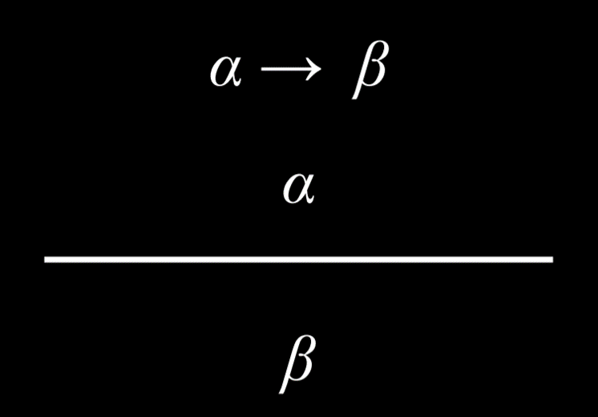
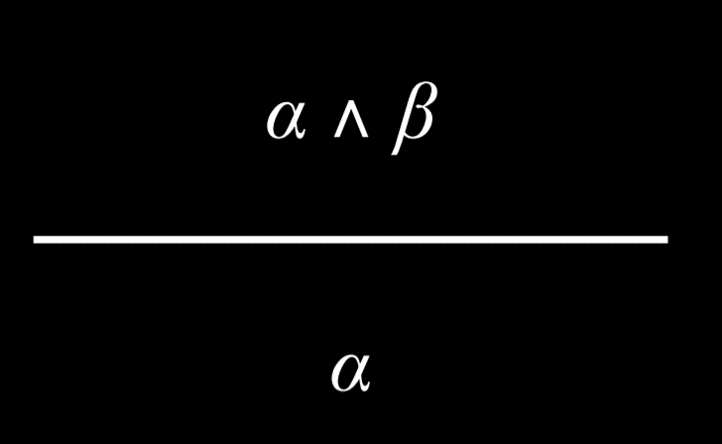
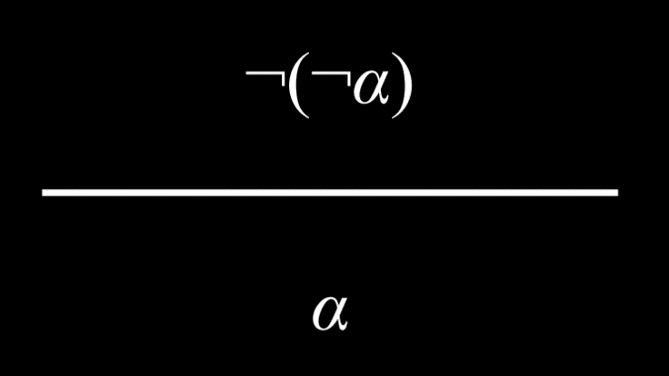
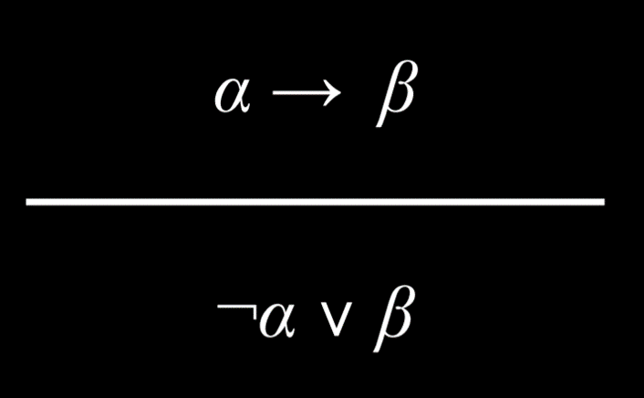
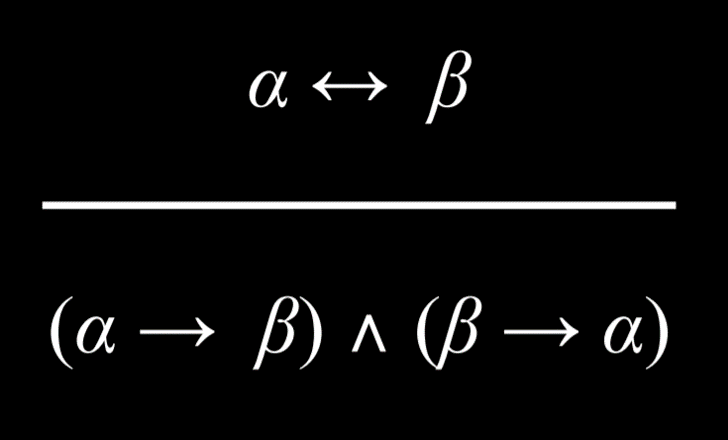
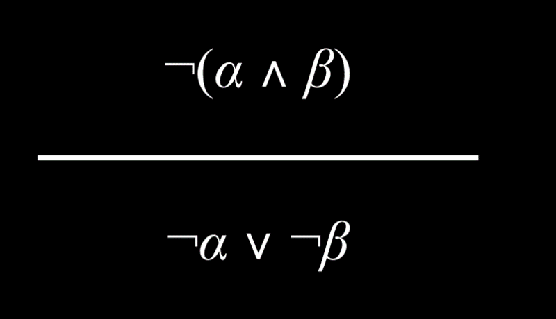
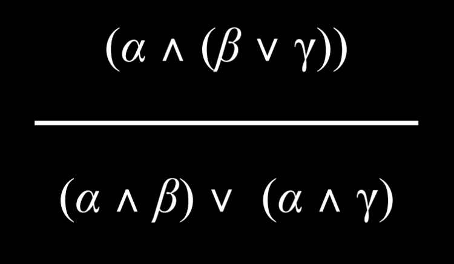
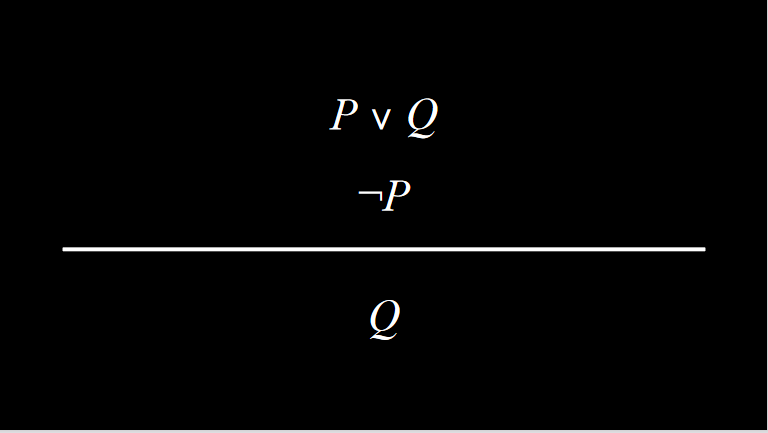

# Knowledge

## Knowleedge-Based Agents

> Agents that reason by by operating on internal representation of knowledge. 

- Sentence : An assertion about the world in a knowledge representation language.

## Propositional Logic

> Logic based on proposition, statements about the world that can be either true or false.

### Propositional Symbols

- Often letters used to represent a proposition.

### Logical Connectives

- Logical connectives are logical symbols that connect propositional symbols in order to reason in a more complex way about the world.

- Not (¬): Inverses the truth value of proposition
- And (∧): Connects two proposition such that th result is true only in the case that both propositions are true.
- Or (∨): The resulting proposition is true as long as either of its arguments is true. (This is inclusive OR)
- Implication (P→Q): It represents a structure of "if P then Q". P is called antecedent and Q is called consequent. If antecedent is true, consequent must be True for the implication to be true. If the antecedent is false, we say that the implication is trivially true.
- Biconditional (↔): Is an implication that goes both direction and can be read as "if and only if".

### **Inclusive vs Exclusive Or**
    - **Inclusive Or**: An example to understand this could be, "In order to eat dessert, you have to clean your room or mow the lawn." In this case, if you do both chores, you will still get the dessert.
    - **Exclusive Or (XOR)**: An example for this could be, "For dessert, you can have either cookies or ice cream." In this case, you can't have both. (A common symbol for XOR is ⊕).

### Model

- The model is an assignment of a truth value to every proposition. 

- For example, if P: “It is raining.” and Q: “It is Tuesday.”, a model could be the following truth-value assignment: {P = True, Q = False}. This model means that it is raining, but it is not tuesday.

### Knowledge Base (KB)

> Set of sentences known by a knowledge-based agent. This is knowledge that AI is provided about the world.

### Entailment(⊨)

If α ⊨ β (α entails β), then in any world where alpha is true, beta is true too.

Entailment is different from implication. Implication is a logical connective between two propositions. Entailment, on the other hand, is a relation that means that if all the information in α is true, then all the information in β is true.

## Inference

> Inference : deductions based on knowledge or process of deriving new sentences from old ones.

- Model Checking Algorithm: To answer a query(question) using the Modeel Checking algorithm, we enumerate all possible models.

```py
from logic import *

# Create new classes, each having a name, or a symbol, representing each proposition.
rain = Symbol("rain")  # It is raining.
hagrid = Symbol("hagrid")  # Harry visited Hagrid
dumbledore = Symbol("dumbledore")  # Harry visited Dumbledore

# Save sentences into the KB
knowledge = And(  # Starting from the "And" logical connective, becasue each proposition represents knowledge that we know to be true.

    Implication(Not(rain), hagrid),  # ¬(It is raining) → (Harry visited Hagrid)

    Or(hagrid, dumbledore),  # (Harry visited Hagrid) ∨ (Harry visited Dumbledore).

    Not(And(hagrid, dumbledore)),  # ¬(Harry visited Hagrid ∧ Harry visited Dumbledore) i.e. Harry did not visit both Hagrid and Dumbledore.

    dumbledore  # Harry visited Dumbledore. Note that while previous propositions contained multiple symbols with connectors, this is a proposition consisting of one symbol. This means that we take as a fact that, in this KB, Harry visited Dumbledore.
    )
```

- To run the Model Checking algorithm, the following information is needed:
    - Knowledge Base, which will be used to draw inferences
    - A query, or the proposition that we are interested in whether it is entailed by the KB
    - Symbols, a list of all the symbols (or atomic propositions) used (in our case, these are rain, hagrid, and dumbledore)
    - Model, an assignment of truth and false values to symbols

```py
def check_all(knowledge, query, symbols, model):

    # If model has an assignment for each symbol
    # (The logic below might be a little confusing: we start with a list of symbols. The function is recursive, and every time it calls itself it pops one symbol from the symbols list and generates models from it. Thus, when the symbols list is empty, we know that we finished generating models with every possible truth assignment of symbols.)
    if not symbols:

        # If knowledge base is true in model, then query must also be true
        if knowledge.evaluate(model):
            return query.evaluate(model)
        return True
    else:

        # Choose one of the remaining unused symbols
        remaining = symbols.copy()
        p = remaining.pop()

        # Create a model where the symbol is true
        model_true = model.copy()
        model_true[p] = True

        # Create a model where the symbol is false
        model_false = model.copy()
        model_false[p] = False

        # Ensure entailment holds in both models
        return(check_all(knowledge, query, remaining, model_true) and check_all(knowledge, query, remaining, model_false))
```

## Knowledge Engineering

> Figuring out how to represent propositions and logic in AI.


## Inference rules

- Model checking is not an efficient algorithm because it has to consider every possible model before giving the answer.

> Inference rules allow us to generate new information based on existing knowledge without considering every possible model.

- Inference rules are usually represented using a horizontal bar that separates the top part, the premise, from the bottom part, the conclusion.

- Modus Ponens: The type of inference rule we use in this example is Modus Ponens, which is a fancy way of saying that if we know an implication and its antecedent to be true, then the consequent is true as well.



- And Elimination: If an And proposition is true, then any one atomic proposition within it is true as well. For example, if we know that Harry is friends with Ron and Hermione, we can conclude that Harry is friends with Hermione.



- Double Negation Elimination: A proposition that is negated twice is true. For example, consider the proposition “It is not true that Harry did not pass the test”. We can parse it the following way: “It is not true that (Harry did not pass the test)”, or “¬(Harry did not pass the test)”, and, finally “¬(¬(Harry passed the test)).” The two negations cancel each other, marking the proposition “Harry passed the test” as true.



- Implication Elimination: An implication is equivalent to an Or relation between the negated antecedent and the consequent. As an example, the proposition “If it is raining, Harry is inside” is equivalent to the proposition “(it is not raining) or (Harry is inside).”



- Biconditional Elimination: A biconditional proposition is equivalent to an implication and its inverse with an And connective. For example, “It is raining if and only if Harry is inside” is equivalent to (“If it is raining, Harry is inside” And “If Harry is inside, it is raining”).



- De Morgan's law: It is possible to turn an And connective into an Or connective. Consider the following proposition: “It is not true that both Harry and Ron passed the test.” From this, it is possible to conclude that “It is not true that Harry passed the test” Or “It is not true that Ron passed the test.” That is, for the And proposition earlier to be true, at least one of the propositions in the Or propositions must be true.


- The reverse is also true.

- Distributive Property: A proposition with two elements that are grouped with And or Or connectives can be distributed, or broken down into, smaller units consisting of And and Or.



- Resolution: Resolution is a powerful inference rule that states that if one of two atomic propositions in an Or proposition is false, the other has to be true. For example, given the proposition “Ron is in the Great Hall” Or “Hermione is in the library”, in addition to the proposition “Ron is not in the Great Hall,” we can conclude that “Hermione is in the library.” More formally, we can define resolution the following way:



## Knowledge and Search Problems

- Inference can be viewed as a search problem with the following properties:
    - Initial state: Starting knowledge base
    - Actions: Inference rules
    - Transition model: New knowledge base after inference
    - Goal test: Checking whether the statement that we are trying to prove is in the knowledge base (KB)
    - Path cost function: The number of steps in the proof

- **Clause**: A clause is a disjunction of literals (a propositional symbol or a negation of a propositional symbol, such as P, ¬P). A disjunction consists of propositions that are connected with an Or logical connective (P ∨ Q ∨ R). A conjunction, on the other hand, consists of propositions that are connected with an And logical connective (P ∧ Q ∧ R). Clauses allow us to convert any logical statement into a Conjunctive Normal Form (CNF), which is a conjunction of clauses, for example: (A ∨ B ∨ C) ∧ (D ∨ ¬E) ∧ (F ∨ G).

- **Steps in Conversion of Propositions to Conjunctive Normal Form**
    - Eliminate biconditionals: Turn (α ↔ β) into (α → β) ∧ (β → α).
    - Eliminate implications: Turn (α → β) into ¬α ∨ β.
    - Move negation inwards until only literals are being negated (and not clauses), using De Morgan’s Laws: Turn ¬(α ∧ β) into ¬α ∨ ¬β.

- Negation gives empty clause. Empty clause is always false.

## First order logic:

irst Order Logic (FOL) is a type of logic that allows for more complex expressions than propositional logic. It uses constant symbols to represent objects and predicate symbols to represent relations or functions. For example, in a logic puzzle about Hogwarts, constant symbols could be people or houses, and predicate symbols could express properties or relations, like whether a person belongs to a house.

FOL also uses quantification. Universal quantification (∀) expresses "for all", while existential quantification (∃) expresses "for at least one". For example, ∀x. BelongsTo(x, Gryffindor) → ¬BelongsTo(x, Hufflepuff) means that if any symbol belongs to Gryffindor, it does not belong to Hufflepuff. ∃x. House(x) ∧ BelongsTo(Minerva, x) means that there is at least one symbol that is both a house and that Minerva belongs to it.

These tools allow us to represent knowledge in AI systems more succinctly and flexibly.