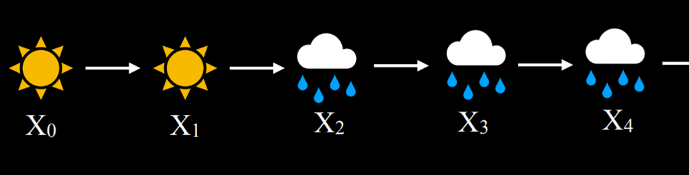

# Uncertainty

> Often, AI has only partial knowledge of the world, leaving space for uncertainty.

## Probability

> Uncertainty can be represented as a number of events and likelihood of each happening.

- Possible worlds:
    - Every possible situation can be thought of as a world, represented by the lowercase Greek letter omega ω.

- Axioms in probability:
    - Every probability must range between 0 and 1.
        - Zero is an impossible event
        - One is an event that is certain to happen
        - Higher the value, the event is more likely to happen
    - The probability of every possible event, when summed together, are equal to 1.

- Unconditional Probabilty: Unconditional probability is the degree of belief in a proposition in the absence of any other evidence.

## Conditional Probabilty:

> Degree of beelief in a proposition given some evidence that has already been revealed.

> P(a/b): the probability of a given b


## Random variables

> A random variable is a variable in probability theory with a domain of possible values that it can take on.

- Probability of each value that the random variable can take is represented using probability distribution.

- **Independence**: Knowledge that the occurence of one event does not affect the probability of the other event. For example, when rolling two dice, the result of each die is independent from the other.

> Mathematically, events a and b are independent if and only if the probability of a and b is equal to the probability of a times the probability of b: P(a ∧ b) = P(a)P(b).

## Bayes Rule

> Bayes rule is commonly used in probability theory to compute conditional probability.


## Joint probability

> Joint probability is the likelihood of multiple events all occuring.

P(C | rain) = P(C ∧ rain)/P(rain) can be used.

## Probability Rules

- Negation: P(¬a) = 1 - P(a).
- Inclusion-Exclusion: P(a ∨ b) = P(a) + P(b) - P(a ∧ b)
- Marginalization: P(a) = P(a, b) + P(a, ¬b).
- Conditioning: P(a) = P(a | b)P(b) + P(a | ¬b)P(¬b).

## Bayesian Networks:

> Data structure that represents the dependencies among random variables.

- Properties:
    - Directed graphs
    - Each node represents a random variable
    - An arrow from X to Y represents that X is a parent of Y or probability distribution of Y depends on the value of X.
    - Each node X has probability distribution P(X | Parents(X))

- For eg: A bayesian network that involves variables that affect whether we get to our appointment on time.


- If we want to find the probability of missing the meeting when the train was delayed on a day with no maintenance and light rain, or P(light, no, delayed, miss), we will compute the following: P(light)P(no | light)P(delayed | light, no)P(miss | delayed).

## Inference: 

- We can also infer new information based on probabilities.
- This doesn't allow us to know new information for certain, it allows us to figure out the probability distributions for somee values.

- Properties:
    - Query X: the variable for which we want to compute the probability distribution
    - Evidence variables E: one or more variables that have been observed for event e.
    - Hidden variables Y: variables that aren't the query and also haven't been observed.
    - The goal: calculate P(X|e)

```markdown
## Example of inference:
We want to compute the probability distribution of the Appointment variable given the evidence that there is light rain and no track maintenance. That is, we know that there is light rain and no track maintenance, and we want to figure out what are the probabilities that we attend the appointment and that we miss the appointment, P(Appointment | light, no). from the joint probability section, we know that we can express the possible values of the Appointment random variable as a proportion, rewriting P(Appointment | light, no) as αP(Appointment, light, no). How can we calculate the probability distribution of Appointment if its parent is only the Train variable, and not Rain or Maintenance? Here, we will use marginalization. The value of P(Appointment, light, no) is equal to α[P(Appointment, light, no, delayed) + P(Appointment, light, no, on time)].
```

## Inference by Enumeration

> Inference by enumeration is a process of finding the probability distribution of variable X given observed evidence e and some hidden variables Y.


Multiple libraries exist in Python to ease the process of probabilistic inference. We will take a look at the library pomegranate to see how the above data can be represented in code.

```py
# First, we create the nodes and provide a probability distribution for each one.
from pomegranate import *

# Rain node has no parents
rain = Node(DiscreteDistribution({
    "none": 0.7,
    "light": 0.2,
    "heavy": 0.1
}), name="rain")

# Track maintenance node is conditional on rain
maintenance = Node(ConditionalProbabilityTable([
    ["none", "yes", 0.4],
    ["none", "no", 0.6],
    ["light", "yes", 0.2],
    ["light", "no", 0.8],
    ["heavy", "yes", 0.1],
    ["heavy", "no", 0.9]
], [rain.distribution]), name="maintenance")

# Train node is conditional on rain and maintenance
train = Node(ConditionalProbabilityTable([
    ["none", "yes", "on time", 0.8],
    ["none", "yes", "delayed", 0.2],
    ["none", "no", "on time", 0.9],
    ["none", "no", "delayed", 0.1],
    ["light", "yes", "on time", 0.6],
    ["light", "yes", "delayed", 0.4],
    ["light", "no", "on time", 0.7],
    ["light", "no", "delayed", 0.3],
    ["heavy", "yes", "on time", 0.4],
    ["heavy", "yes", "delayed", 0.6],
    ["heavy", "no", "on time", 0.5],
    ["heavy", "no", "delayed", 0.5],
], [rain.distribution, maintenance.distribution]), name="train")

# Appointment node is conditional on train
appointment = Node(ConditionalProbabilityTable([
    ["on time", "attend", 0.9],
    ["on time", "miss", 0.1],
    ["delayed", "attend", 0.6],
    ["delayed", "miss", 0.4]
], [train.distribution]), name="appointment")
```

```py
# Create a Bayesian Network and add states
model = BayesianNetwork()
model.add_states(rain, maintenance, train, appointment)

# Add edges connecting nodes
model.add_edge(rain, maintenance)
model.add_edge(rain, train)
model.add_edge(maintenance, train)
model.add_edge(train, appointment)

# Finalize model
model.bake()
```

```py
# Calculate probability for a given observation
probability = model.probability([["none", "no", "on time", "attend"]])

print(probability)
```

- Otherwise, we could use the program to provide probability distributions for all variables given some observed evidence.

```py
# Calculate predictions based on the evidence that the train was delayed
predictions = model.predict_proba({
    "train": "delayed"
})

# Print predictions for each node
for node, prediction in zip(model.states, predictions):
    if isinstance(prediction, str):
        print(f"{node.name}: {prediction}")
    else:
        print(f"{node.name}")
        for value, probability in prediction.parameters[0].items():
            print(f"    {value}: {probability:.4f}")
```

- This approach is inefficient, especially given many variables. 
- We can favor approximate inference over exact by giving up some precision in generated probabilities.

## Sampling

> Sampling is one technique of approximate inference. 

- For eg: to get distribution using sampling with a die:
    - we roll the die multiple times and record value we get.
    - If we roll enough times, we can get close enough probability. 

- Example code:

```py
import pomegranate

from collections import Counter

from model import model

def generate_sample():

    # Mapping of random variable name to sample generated
    sample = {}

    # Mapping of distribution to sample generated
    parents = {}

    # Loop over all states, assuming topological order
    for state in model.states:

        # If we have a non-root node, sample conditional on parents
        if isinstance(state.distribution, pomegranate.ConditionalProbabilityTable):
            sample[state.name] = state.distribution.sample(parent_values=parents)

        # Otherwise, just sample from the distribution alone
        else:
            sample[state.name] = state.distribution.sample()

        # Keep track of the sampled value in the parents mapping
        parents[state.distribution] = sample[state.name]

    # Return generated sample
    return sample
```

```py
# Rejection sampling
# Compute distribution of Appointment given that train is delayed
N = 10000
data = []

# Repeat sampling 10,000 times
for i in range(N):

    # Generate a sample based on the function that we defined earlier
    sample = generate_sample()

    # If, in this sample, the variable of Train has the value delayed, save the sample. Since we are interested interested in the probability distribution of Appointment given that the train is delayed, we discard the sampled where the train was on time.
    if sample["train"] == "delayed":
        data.append(sample["appointment"])

# Count how many times each value of the variable appeared. We can later normalize by dividing the results by the total number of saved samples to get the approximate probabilities of the variable that add up to 1.
print(Counter(data))
```

- In the sampling example above, we discarded the samples that did not match the evidence that we had. This is inefficient. One way to deal with this is likelihood weighing.

- Likelihood Weighing
    - Start by fixing the values for evidence variables
    - Sample the non-evidence variables using conditional probabilites in the Bayesian network
    - Weight each sample by its likelihood: the probability of all the evidence occuring.

## Markov Models

> Markov Models are used to predict events in the future. 

- Markov Assumption: Current state depends on only a finite number of previous states.

- Markov Chain: Sequencee of random variables where the distribution of each variable follows the Markov assumption. 
- For constructing Markov chain, we need a transition model that will specify the probability distributions of the next event based on the possible values of current event.




- Given this Markov Chain, we can now answer questions such as "what is the probability of having four rainy days in a row?"

```py
from pomegranate import *

# Define starting probabilities
start = DiscreteDistribution({
    "sun": 0.5,
    "rain": 0.5
})

# Define transition model
transitions = ConditionalProbabilityTable([
    ["sun", "sun", 0.8],
    ["sun", "rain", 0.2],
    ["rain", "sun", 0.3],
    ["rain", "rain", 0.7]
], [start])

# Create Markov chain
model = MarkovChain([start, transitions])

# Sample 50 states from chain
print(model.sample(50))
```

## Hidden Markov Models

> Hidden Markov model is a type of Markov model for a system with hidden states that generated some observed event.

- This means that sometimes, AI has some measurement of the world but no access to the precise state of the world. Those states are called hidden state and whatever data the AI has access are the observations.

- Consider this sensor model:


- In this model, if it is sunny, it is most probable that people will not bring umbrellas to the building....

- Sensor Markov Assumption:
    - The assumption that the evidence variable depends only on the corresponding state. Here, we assume that whether people bring umbrellas to the office depends only on the weather.

- A hidden Markov Modele can be represented in a markov chain with two layers. The top layer X, stands for the hidden state. The botton layer, E, stands for the evidence, the observations that we have.


Based on Hidden Markov Models, we can achieve multiple tasks:

1. **Filtering**: Given observations from the start until now, we can calculate the probability distribution for the current state. For example, given information on when people bring umbrellas from the start of time until today, we can generate a probability distribution for whether it is raining today or not.

2. **Prediction**: Given observations from the start until now, we can calculate the probability distribution for a future state.

3. **Smoothing**: Given observations from the start until now, we can calculate the probability distribution for a past state. For example, we can calculate the probability of rain yesterday given that people brought umbrellas today.

4. **Most Likely Explanation**: Given observations from the start until now, we can calculate the most likely sequence of events.

```py
from pomegranate import *

# Observation model for each state
sun = DiscreteDistribution({
    "umbrella": 0.2,
    "no umbrella": 0.8
})

rain = DiscreteDistribution({
    "umbrella": 0.9,
    "no umbrella": 0.1
})

states = [sun, rain]

# Transition model
transitions = numpy.array(
    [[0.8, 0.2], # Tomorrow's predictions if today = sun
     [0.3, 0.7]] # Tomorrow's predictions if today = rain
)

# Starting probabilities
starts = numpy.array([0.5, 0.5])

# Create the model
model = HiddenMarkovModel.from_matrix(
    transitions, states, starts,
    state_names=["sun", "rain"]
)
model.bake()
```

- Our model has both sensor model and the transition mode. 
- Now we see a sequence of observations of whether people brought umbrellas to the building or not, and based on this sequence we will run the model, which will generate and print the most likely explanation.

```py
from model import model

# Observed data
observations = [
    "umbrella",
    "umbrella",
    "no umbrella",
    "umbrella",
    "umbrella",
    "umbrella",
    "umbrella",
    "no umbrella",
    "no umbrella"
]

# Predict underlying states
predictions = model.predict(observations)
for prediction in predictions:
    print(model.states[prediction].name)
```

- In this case, the output of the program will be rain, rain, sun, rain, rain, rain, rain, sun, sun.

