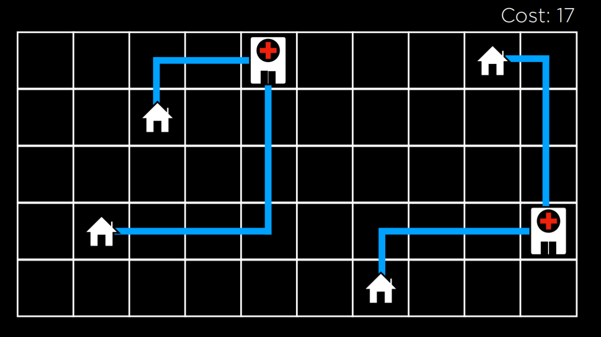
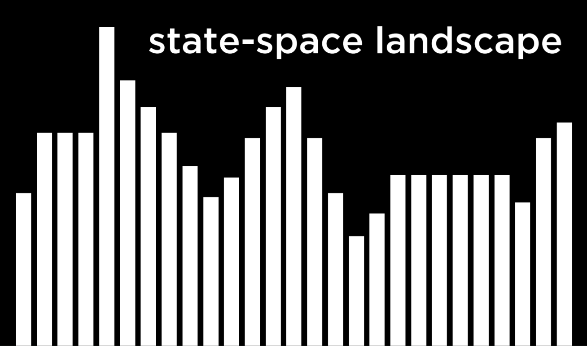
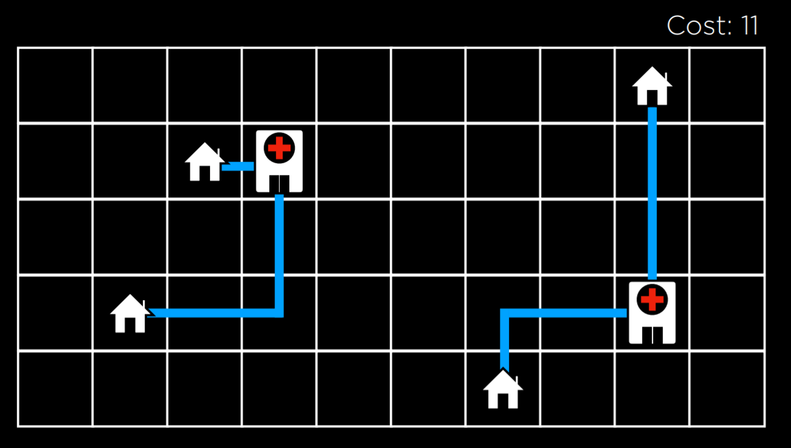
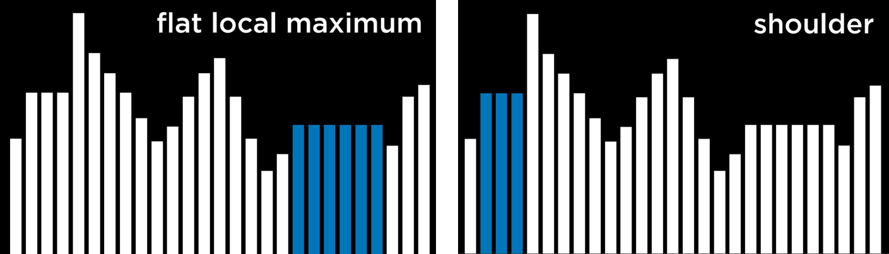

# Optimization

> Choosing the best option from a set of possible options.

## Local Search

> Local search is a search algorithm that maintains a single node and searches by moving to a neighbouring node.

- Often, local search will bring to an answer that is not optimal but "good enough", conserving computational power.

- In local search, primary focus is on the solution not the procedure itself.

- Consider this problem of minimizing the overall distance between house and hospital.


- Here, the cost is 17. We want to minimize that.



- The figure above is state-space landcape. 
- Each bar is a state.
- The height is some value that we are trying to minimize or maximize.

- Some terms:
    - Objective function: Function that we use to mazimize the value of a solution.
    - Cost function: Function that we use to minimize the cost of the solution.
    - Current State: State that is currently being considered by the function.
    - Neighbour State: State that current state can transition to.

## Hill Climbing

- In this algoritm, the neighbour states are compared to the current state, and if any of them is better, we change the current node from the current state to that neighbour state.

- Better state is defined by whether we use an objective function or an cost function.

```markdown
# Hill Climbing Algorithm Pseudocode

function Hill-Climb(problem):
    - current  = initial state of problem
    - repeat:
        - neighbor = best valued neighbor of current
        - if neighbor not better than current:
            - return current
        - current  = neighbor
```

- Consider the hospital problem from before. After few transitions we can get to this:


- At this state, cost is 11 which is not optimal. If we move the hospital on the left to be underneath the top left house, it would bring to a cost of 9 but we can't get there will hill climbing algorithm.

> Hill climbing algorithm can get stuck in local maxima or minima.

- A local maximum is a state that has a higher value than its neighboring states. 
- A global maximum is a state that has the highest value of all states in the state-space.
- Local minimum and global minimum have similar concept.

- Other situations where hill climbing algorithm can stop are shoulder and flat local maximum or plateau.



## Varients of hill climbing algorithms:

- Steepest-ascent: Standard variation discussed above.
- Stochastic: Choose randomly from higher-valued neighbors. We choose to go to any direction that improves our value. 
- First choice: Choose the first higher-valued neighbor
- Random-restart: Conduct multiple time and start from random state each time. Compare maxima from each attempt.
- Local Beam Search: Chooses the k highest-valued neighbors. This is unlike most local search as it uses multiple nodes for the search and not just one. 

> Local search algorithms don't always give the best possible solution but they often give a good enough solution in situations where considering every possible states is computationally infeasible.

## Simulated Annealing

> Simulated annealing allows the algorithm to dislodge itself it it gets stuck in a local maximum.

- Metaphor: Annealing is the process of heating metal and allowing it to cool slowly, which serves to toughen the metal. 

- Annealing mechanism allows the algorithm to change its state to a neighbor that's worse than current state, which is how it escapes from the local maxima.

```markdown
# Simulated-Annealing pseudocode

function Simulated-Annealing(problem, max):
    - current = initial state of problem
    - for t = 1 to max:
        - T = Temperature(t)
        - neighbor = random neighbor of current
        - ΔE = how much better neighbor is than current
        - if ΔE > 0:
            - current = neighbor
        - with probability e^(ΔE/T) set current = neighbor
    - return current
```
- probability e^(ΔE/T) makees it so that worse the neighbor state, the less likely it is to be chosen, and earlier the algorithm is in its process, the more likely it is to set a worse neighbor state as current state.

## Travelling Salesman Problem

> In the traveling salesman problem, the task is to connect all points while choosing the shortest possible total distance.

- When just considering 10 points, we have 10! or 3628800 possible routes. By using simulated annealing algorithm, a good solution can be found for a lower computational cost.

## Linear Programming

> A family of problems that optimize a linear equation.

- Components of Linear Programming Problems:
    - A cost function or Objective function
    - A set of constriants i.e. conditions
    - Individual bounds on variables.(for eg. that a variable can't be negative.)

> An optimizing algorithm for linear programming requires background knowledge in geometry and linear algebra. But, we can use algorithms that already exists, such as Simplex and Interior-Point.

```py
import scipy.optimize

# Objective Function: 50x_1 + 80x_2
# Constraint 1: 5x_1 + 2x_2 <= 20
# Constraint 2: -10x_1 + -12x_2 <= -90

result = scipy.optimize.linprog(
    [50, 80],  # Cost function: 50x_1 + 80x_2
    A_ub=[[5, 2], [-10, -12]],  # Coefficients for inequalities
    b_ub=[20, -90],  # Constraints for inequalities: 20 and -90
)

if result.success:
    print(f"X1: {round(result.x[0], 2)} hours")
    print(f"X2: {round(result.x[1], 2)} hours")
else:
    print("No solution")
```

## Constriant Satisfaction

> Class of problems where the variable need to be assigned values while satisfying some conditions.

- Properties:
    - Set of variables (x₁, x₂, …, xₙ)
    - Set of domains for each variable {D₁, D₂, …, Dₙ}
    - Set of constraints C

- Sodoku can be represented as a constriant satisfaction problem, where each empty square is a variable, the domain is the number 1-9, and the constriants are the squares that can't be equal to each other.

- More terms:
    - Hard constriant: expresses rule/requirement
    - Soft constriant: expresses preference
    - Unary constriant: involves one variable
    - Binary constriant: involves two variables

## Node consistency

> Node consistency is when all the values in a variable's domain satisfy the variable's unary constraints.

## Arc Consistency

> Arc consistency is when all the values in a variable's domain satisfy the variable's domain satisfy the variable's binary constriants.

- To make X arc-consistent with respect to Y, remove elments of X's domain until every choice for X has a possible choice for Y.

```markdown
function Revise(csp, X, Y)
    - revised = false
    - for x in X.domain:
        - if no y in Y.domain satisfies constriant for (X,Y):
            - delete x from X.domain
            - revised = true
    - return revised
```

- If we are interested in making the whole problem arc-consistent and not just one variable with respect to anothe:

```markdown
# This algorithm is called AC-3 which uses Revise

function AC-3(csp):
    - queue = all arcs in csp
    - while queue not-empty:
        - (X,Y) = Dequeue(queue)
        - if Revise(csp, X, Y):
            - if size of X.domain == 0:
                - return false
            - for each Z in X.neighbors - {Y}:
                - Enqueue(queue, (Z,X))
    - return true
```

- This algorithm adds all the arcs in the problem to a queue. Each time it considers an arc, it removes it from the queue. Then it runs the Revise algorithm.

## Constriant Satisfaction problem as Search Problem

- Initial condition: empty assignment
- Actions: Give some variable to value
- Transition model: Shows how adding the assignment changes the assignment.
- Goal test: Check if all variables are assigned a value and all constriants are satisfied.
- Path cost function: all paths have the same cost.

## Backtracking Search

> Type of search algorithm that takes into account the structure of a constriant satisfaction search problem.

```markdown
# Backtracking Algorithm

function Backtrack(assignment, csp):
    - if assignment complete:
        - return assignment
    - var = Select-Unassigned-Var(assignment, csp)
    - for value in Domain-Values(var,assignment,csp):
        - add {var = value} to assignment
        - result = Backtrack(assignment, csp)
        - if result != failure:
            - return result
        - remove {var = value} from assignment
    - return failure
```

- This is a widely used algoritm and multiple libraries already contain an implementation of it.

## Inference

- Although backtracking search is more efficient than simple search, it still takes a lot of computational power.

- We can get more efficient algorithm by interleaving backtracking search with inference.

```markdown
# Backtracking Algorithm with Inferences

function Backtrack(assignment, csp):
    - if assignment complete:
        - return assignment
    - var = Select-Unassigned-Var(assignment, csp)
    - for value in Domain-Values(var, assignment, csp):
        - if value consistent with assignment:
            - add {var = value} to assignment
            - inferences = Inference(assignment, csp)
            - if inferences ≠ failure:
                - add inferences to assignment
            - result = Backtrack(assignment, csp)
            - if result ≠ failure:
                - return result
            - remove {var = value} and inferences from assignment
    - return failure
```

## Heuristics

> A heuristic, most often than not, will bring to a better result than following a naive approach, but is not guaranteed to do so.

- Some common heuristics are:
    - Maximum remaining Value heuristic
    - Degree heuristic
    - Least constrianing values heuristic