# Machine Learning

> Machine learning : Teaching computer to recognize patterns and perform tasks by providing data rather than explicit instructions.

## Supervised Learning

> Computer learns a function that maps inputs to outputs based on a dataset of input-output pairs.

- One of the task in supervised learning is Classification: mapping an input to a discrete output.
- For eg: Teaching computer to decide whether it will rain that day or not, given humidity and air pressure for a particular day as input.

## Nearest-Neighbor Classification

> Assigning the variable in question the value of the closest observation.

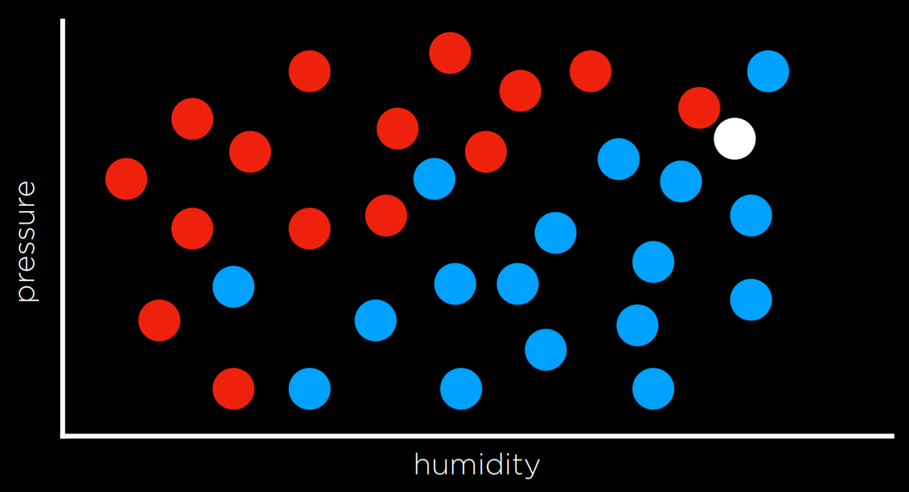

- Here, white dot is closer to group of blue dots, so it is classified as blue dot.

## Perceptron Learning

> By creating a decision boundary by looking at the data as a whole.

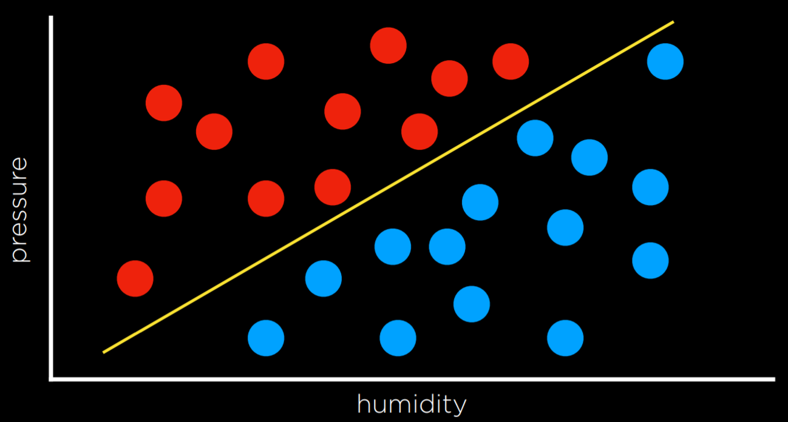

- During prediction, input x1:Humidity and x2:Pressure will be given to a hypothesis function h(x1,x2) which will output its prediction of whether it is going to rain that day or not.

- Goal of machine learning algorithm in this case is to "train" the machine to identify proper value of function parameters.

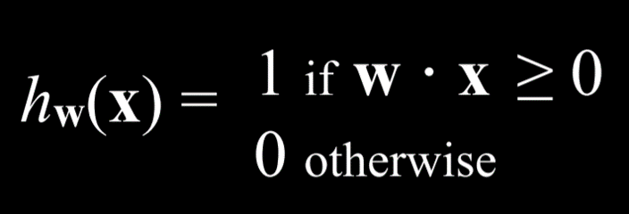

- For this hypothetical function, we need to find the best weight vector. When the algorithm encounters new data it updates the current weights. This is done using perceptron learning rule.

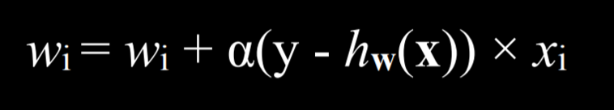

> Main takeaway is that we adjust the weights to make our function more accurate.

- The result of this process is a threshold function that switches from 0 to 1 once the estimated value crosses some threshold.

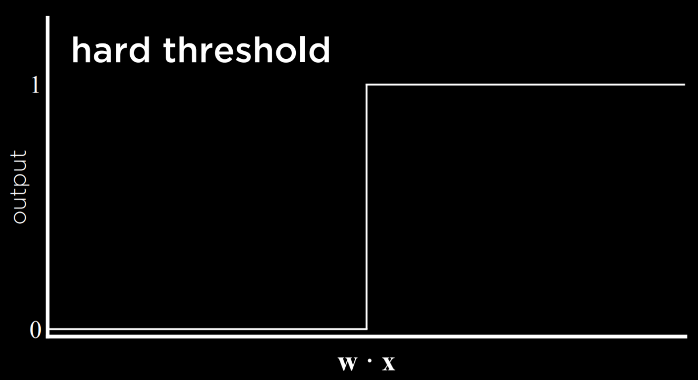
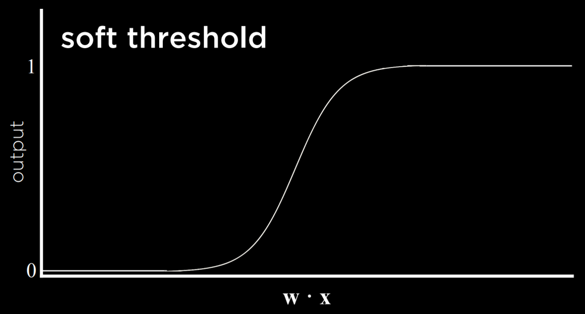

- Hard threshold is unable to express uncertainty whereas soft threshold is.

## Support Vector Machines

> It uses additional vector(support vector) near the decision boundary to make the best decision when separating the data.

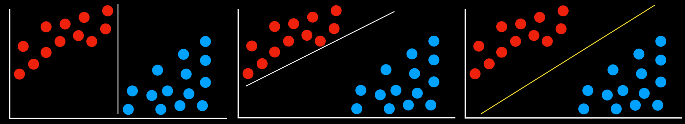

- Heree all decision boundaries separate the data without mistake. However, first two decision boundaries are very close to some of the observations. This means that a new data point that differs only slightly from one group can be wrongly classified as the other.

> The last boundary which is as far as possible from the two groups it separates is called the Maximum Margin Separator.

- Additional benefit of SVM is that they can represent decision boundaries with more than two dimensions, as well as non-linear decision boundaries.

## Regression

> Regression is a supervised learning task of a function that maps an input point to a continuous value, some real number.

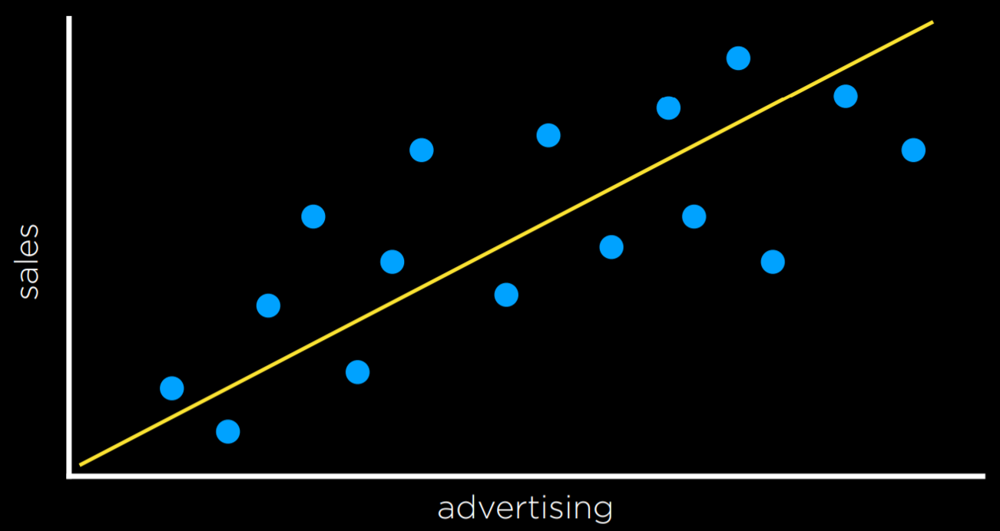

## Loss function

> Loss functions are a way to quantify the utility lost by any of the decision rules. The less accurate the prediction, the larger the loss.

- For classification problems, we can use 0-1 Loss function

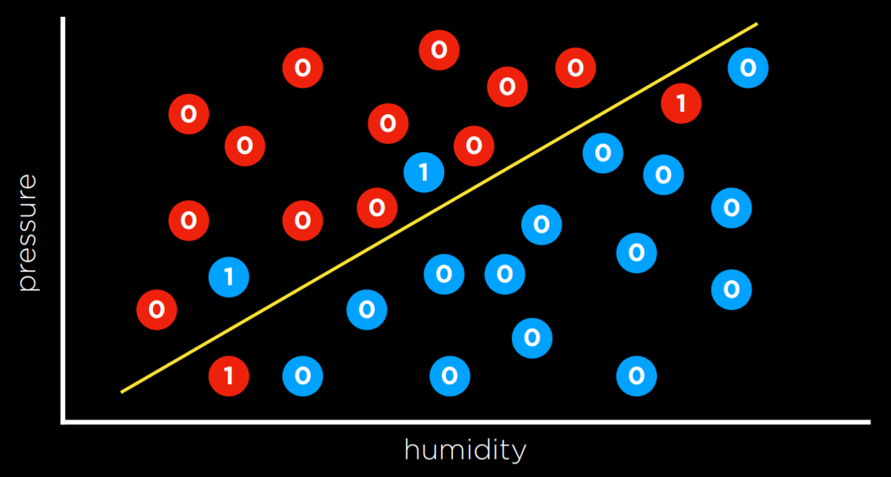

- It gives loss as 1 for wrong prediction and as 0 for right.

- L1 and L2 loss functions can be used when predicting a continuous value.

- L₁: L(actual, predicted) = |actual - predicted|
- L₂: L(actual, predicted) = (actual - predicted)²

- L2 penalizes outliers more harshly than L1. L1 can be visualized by summing the distances from each observed point to the predicted point on the regression line.

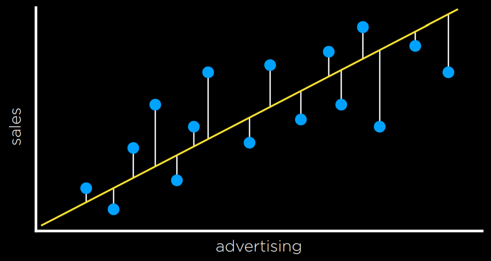

## Overfitting

> When a model fits a training data so well that it fails to generalize to other data sets.

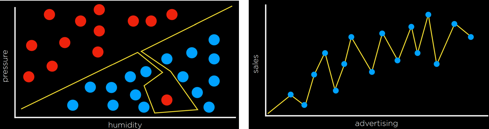

## Regularization

> Process of penalizing hypothesis that are more complex to favor simpleer, more general hypothesis. Used to avoid overfitting.

```markdown
cost(h) = loss(h) + λcomplexity(h)
```
- Here lambda is a constant that can be used to modulate how strongly to penalize for complexity in our cost function. The higher λ is, the more costly complexity is.

> Holdout Cross Validation: Splitting data into two: a training set and a test set. We run the learning algorithm on the training set, and then see how well it predicts the data in the test set.

- Downside of holdout cross validation is that we don't get to train the model on test data, since it is used for evaluation proposes.

> K-fold Cross-Validation: We divide the data into k-sets. We run the training k-times, each time leaving one dataset and using it as a test set. We end up with k different evaluations of our model, which we average to get estimate of how our model generalizes.

## Reinforcement Learning

> After each action, the agent gets feedback in the form of reward or punishment (a positive or a negative numerical value)

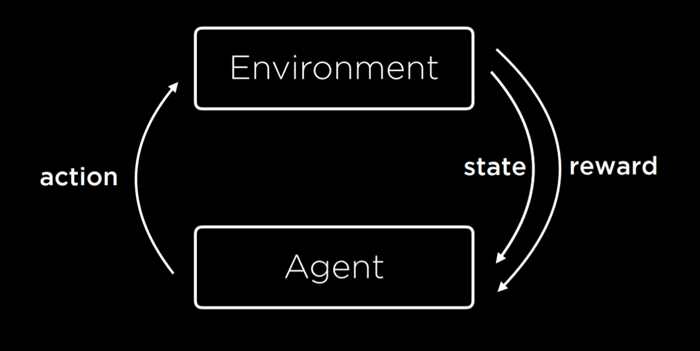

- This type of algorithm is used to train walking robots.

## Reinforcement learning as Markov decision process.

- With following properties:
    - Set of States S
    - Set of actions Actions(S)
    - Transition modl P(s'|s,a)
    - Reward function R(s,a,s')

## Q learning

> Model of reinforced learning, where a function Q(s,a) outputs the value of taking action a in a state s.

Here is a condensed summary of Q-Learning, broken down into steps and aligned with the detailed explanation you provided:

### Summary of Q-Learning

1. **Initialization:**
   - Set \( Q(s, a) = 0 \) for all state-action pairs \( (s, a) \).
   - Define learning rate \( \alpha \) and discount factor \( \gamma \).

2. **Action Selection (Exploration vs. Exploitation):**
   - Choose an action \( a \) in state \( s \) using an ε-greedy strategy:
     - With probability \( 1 - \epsilon \), choose the action with the highest Q-value (exploitation).
     - With probability \( \epsilon \), choose a random action (exploration).

3. **Perform Action:**
   - Execute the selected action \( a \).
   - Observe the reward \( r \) and the new state \( s' \).

4. **Q-Value Update:**
   - Update \( Q(s, a) \) using the formula:
     \[
     Q(s, a) \leftarrow Q(s, a) + \alpha \left[ r + \gamma \max_{a'} Q(s', a') - Q(s, a) \right]
     \]
   - Here, \( r + \gamma \max_{a'} Q(s', a') \) is the new value estimate combining current reward and future reward.

5. **Repeat:**
   - Update state \( s \) to \( s' \).
   - Repeat steps 2-4 until convergence or for a predefined number of iterations.

> New value estimate is expressed as a sum of reward(r) and the future reward estimate.

## Unsupervised Learning

> Only input data is present without labels and the AI learns patterns in these data.


## Clustering

> Clustering takes input data and organizes it into groups such that similar objects end up in the same group.

- Can bee used in genetic research, image segmentation etc. among others.

## K-means Clustering

> Maps all data points in space and then randomly placees k cluster centers in the space. 

- Each cluster gets assigned all the points that are closest to its center than to any other center.

- Iteratively, cluster center moves to the middle of these points, and then points are reassigned again to the clusters whose centers are closest to them. 

- When, after repeating, each point remains in the same cluster it was before, we have reached an equilibrium and the algorithm is over.