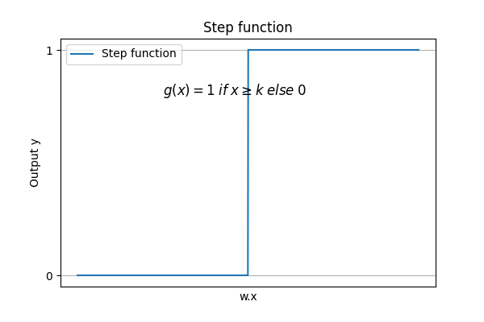
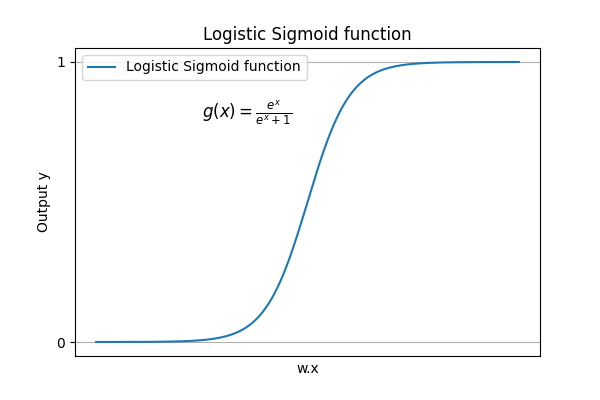
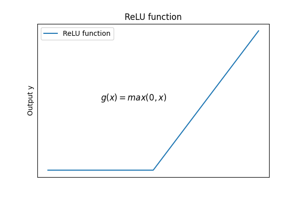
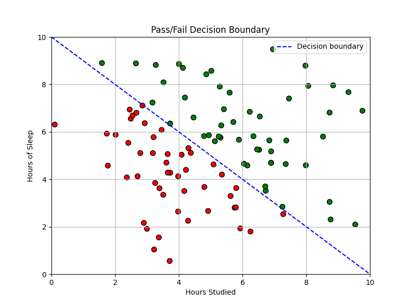
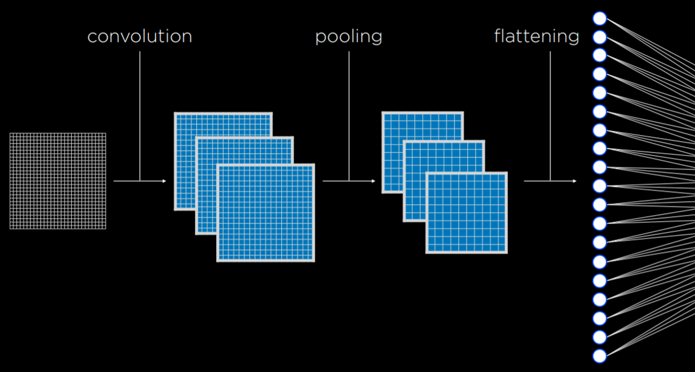
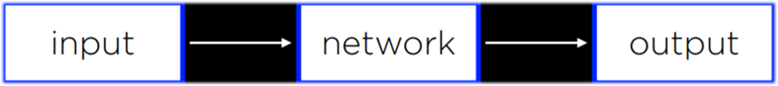

# Neural Networks

> Artificial Neural Network is a mathematical model for learning inspired by biological neural networks.

- Each neuron is capable of both receiving and sending electrical signals. Once the electrical input that a neuron receives crosses some threshold, the neuron activates, thus sending its electrical signal forward.

- Parallel of each neuron is a unit that is connected to other units:

## Activation function

> Activation functions help make decisions based on inputs, bias, and weights.

- Hypothesis function: `h(x₁, x₂) = w₀ + w₁x₁ + w₂x₂`, where `w₁` and `w₂` are weights that modify the inputs, and `w₀` is a constant, also called bias, modifying the value of the whole expression.

```markdown
# Step function

> Step function gives 0 before a certain threshold is reached and 1 after the threshold is reached.
```


```markdown
# Logistic function

> gives as output any real number from 0 to 1, thus expressing graded confidence in its judgment.
```


```markdown
# Rectified Linear Unit(ReLU)

- allows the output to be any positive value. If the value is negative, ReLU sets it to 0.
```


## Neural Network Structure

> A neural network can be thought of as a representation of the idea, where a function sums up inputs to produce an output.
A neural network is capable of infering knowledge about the structure of the network itself from the data.
## Gradient Descent

> Gradient descent is an algorithm for minimizing loss when training neural networks. 

Neural networks allow us to compute these weights based on the training data. To do this, we use the gradient descent algorithm, which works in the following way:

1. Start with a random choice of weights. This is our naive starting place, where we don’t know how much we should weight each input.
2. Repeat the following steps:
    - Calculate the gradient based on all data points that will lead to decreasing loss. Ultimately, the gradient is a vector (a sequence of numbers).
    - Update weights according to the gradient.

- The above algorithm requires to calculate the gradient based on all data points, which is computationally costly. There are two common ways to minimize cost:
    - Stochastic Gradient Descent (SGD) calculates the gradient based on one randomly chosen data point
    - Mini-Batch Gradient Descent uses a small random sample of data points, compromising between computation and accuracy.

- None of these solutions is perfect, and different solutions might be employed in different situations.

## Perceptron:

> Perceptron-based neural networks can only learn linear decision boundaries, effectively separating data with a straight line. However, when data is not linearly separable, multilayer neural networks are used to model data non-linearly.



- This only works for linearly separable variables

## Multi layer neural networks

> A multilayer neural network is an artificial neural network with an input layer, an output layer, and at least one hidden layer.

- Through hidden layers, it is possible to model non-linear data.

## Backpropagation

> Backpropagation is the main algorithm used for training neural networks with hidden layers. It does so by starting with the errors in the output units, calculating the gradient descent for the weights of the previous layer, and repeating the process until the input layer is reached. 

To train a neural network using backpropagation, follow these steps:

1. **Calculate error for the output layer**: This is typically the difference between the network's output and the desired output.

2. **Propagate the error backwards**: Starting from the output layer and moving towards the input layer, propagate the error back one layer at a time. In other words, each layer sends its error to the preceding layer.

3. **Update the weights**: After the errors have been propagated all the way back to the input layer, use these errors to update the weights in the network. This is typically done using a method like gradient descent, where the weights are adjusted in the direction that most decreases the error.

Repeat these steps for many iterations, until the network's output is satisfactory.

## Overfitting

> Overfitting is the danger of modeling the training data too closely, thus failing to generalize to new data.

- One way to combat overfitting is by dropout.
    - In this technique, we temporarily remove random units that we select at learning phase. This prevents over-reliance on any one unit.

## TensorFlow

> Library for building and training neural networks. It provides a comprehensive set of tools and functions for creating and optimizing neural network models. TensorFlow supports both CPU and GPU computations, making it suitable for a wide range of applications.

## Computer Vision

> Encompasses various computational methods for analyzing and understanding digital images, and is often achieved using neural networks.

- Image Convolution:
    - Applying a filter that adds each pixel value of an image to its neighbours, weighted according to a kernel matrix. Doing that alters the image and can help the neural network process it.

- Pooling:
    - Processing images in a neural network is computationally expensive due to the large number of input pixels.

    - Pooling is a technique used to reduce the size of the input and thus computational complexity.

    - In pooling, one pixel can represent a whole region of similar pixels.

    - Max-Pooling is a specific type of pooling where the pixel with the highest value in a region is chosen to represent that region.

    - An example of max-pooling is dividing an image into 2X2 squares and selecting the highest value pixel from each square, resulting in a smaller image.

## Convolutional Neural Networks

> A convolutional neural network is a neural network that uses convolution, usually for analyzing images.

- By applying filters (convolution), we can distill some features of the image using different kernels. The filters can be improved in the same ways as weights in the neural networks, by adjusting them on the basis of the error of the output.

- Then, the resulting images are pooled, after which pixels are fed to a traditional neural network as input (a process called flattening)



- Convolution and pooling can be performed multiple times to extract additional features and reduce the size of the input to the neural networks.

> By convoluting and pooling, the neural network becomes less sensitive to variation. i.e. If the same picture is taken from slightly different angles, the input for convolutional neural network will be similar, whereas, without convolution and pooling, the input from each image would be vastly different.

## Recurrent Neural Networks

- Forward-feed Neural networks: input data is provided which eventually produces some output.



> Recurrent Neural Networks consist of a non-linear structure, where the network uses its own output as input. RNNs are capable of varying the number of outputs, unlike Forward Feed Neural Networks.

- RNN can be helpful in cases where the network deals with sequences and not a single individual object. For eg: producing sequence of words, analyzing video files, translation tasks etc.