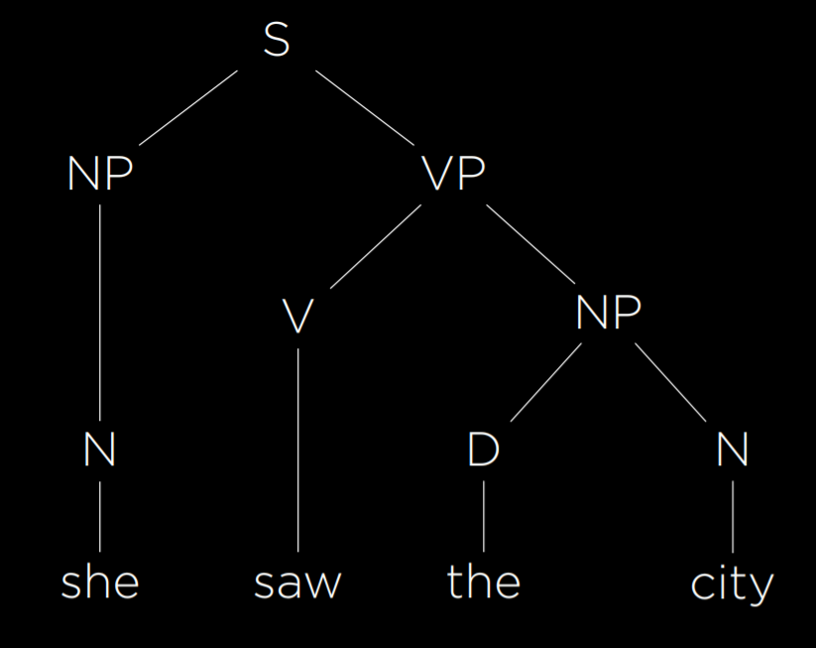
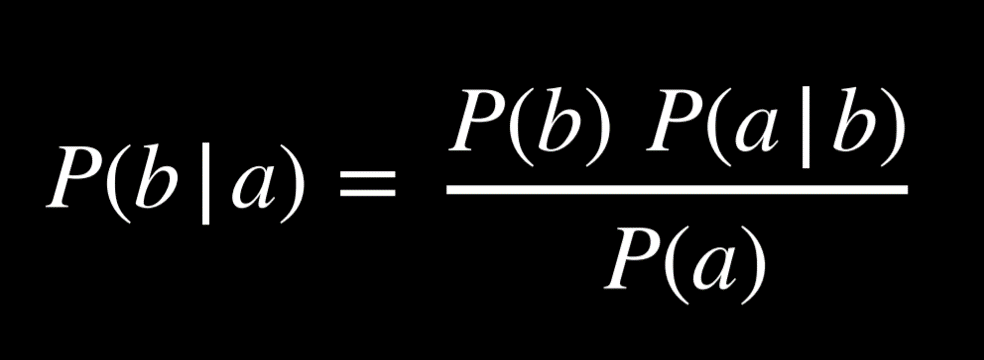
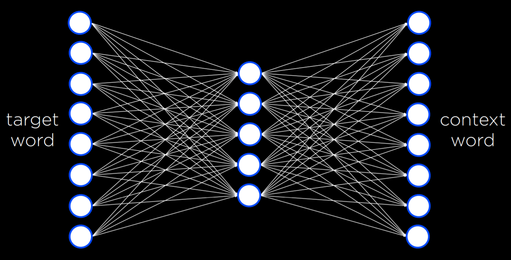

# Language

## Natural Language Processing (NLP)

NLP encompasses tasks where AI processes human language as input. Here are a few examples:

- **Automatic Summarization**: The AI is given text as input and produces a summary of the text as output.
- **Information Extraction**: The AI is given a corpus of text and extracts data as output.
- **Language Identification**: The AI is given text and returns the language of the text as output.
- **Machine Translation**: The AI is given a text in the origin language and outputs the translation in the target language.
- **Named Entity Recognition**: The AI is given text and extracts the names of entities in the text (e.g., names of companies).
- **Speech Recognition**: The AI is given speech and produces the same words in text.
- **Text Classification**: The AI is given text and needs to classify it as some type of text.
- **Word Sense Disambiguation**: The AI needs to choose the right meaning of a word that has multiple meanings (e.g., 'bank' can mean a financial institution or the ground on the sides of a river).

## Syntax and Semantics

> Syntax is set of rules and Semantics is meaning or interpretation.

- Syntax is sentence structure. 

-  Syntax can be grammatical and ambiguous at the same time, as in “I saw the man with the telescope.” Did I see (the man with the telescope) or did I see (the man), doing so by looking through the telescope?

- Semantics is the meaning of words or sentences.

- While the sentence “Just before nine o’clock Sherlock Holmes stepped briskly into the room” is syntactically different from “Sherlock Holmes stepped briskly into the room just before nine o’clock,” their content is effectively identical.

-  Sentence can be perfectly grammatical while being completely nonsensical, as in Chomsky’s example, “Colorless green ideas sleep furiously.”


## Context-Free Grammar

> Fromal Grammar is a system of rules for generating sentences in a language. 

- In Context-Free Grammar, the text is abstracted from its meaning to represent the structure of the sentence using formal grammar.



## NLTK - Natural Language Toolkit

```py
import nltk

grammar = nltk.CFG.fromstring("""
    S -> NP VP

    NP -> D N | N
    VP -> V | V NP

    D -> "the" | "a"
    N -> "she" | "city" | "car"
    V -> "saw" | "walked"
""")

parser = nltk.ChartParser(grammar)

sentence = input("Sentence: ").split()
try:
    for tree in parser.parse(sentence):
        tree.pretty_print()
        tree.draw()
except ValueError:
    print("No parse tree possible.")
```

## n-grams

> N-gram is a sequence of n items from a sample of text. 

- In a character n-grams, the items are characters, and in a word n-gram the items are words. 

- n-grams are useful for text processing. While the AI hasn't necessarily seen the whole sentence before, it sure has seen parts of it.
- Since some words occur together more often than others, it is possible to also predict the next word with some probability.

## Tokenization

> Splitting a sentence into pieces(tokens).

- Word tokenization or sentence tokenization.

- Challenges:
    - Splitting based on spaces leaves behind punctuations.
    - Removing punctuations isn't as simple due to apostrophe, hyphen and period after Mr, Mrs etc.

## Markov Models

> Markov models consist of nodes, the value of each of which has a probability distribution based on a finite number of previous nodes.

- Can be used for text generation. Can be implemented using nltk only as well.

- These sentences are often grammatical and sounding superficially similar to human language output but lack actual meaning and purpose.

## Bag-of-Words Model

> Represents a model that represents text as an unordered collection of words. 

- This model ignores syntax and considers only the meanings of the words in the sentence.

- Helpful in classification tasks, like sentiment analysis, email spam detection etc.

## Naive Bayes

> Technique that can be used in sentiment analysis with the bag of words model. 

- In sentiment analysis, we are asking "What is probability that the sentence is positive/negative given the words in the sentence".



- Strength: Sensitive to words that occur more often in one type of sentence than in the other.

- Issue:
    - We may run into some words that never appear in certain type of netwrork.
    - Solution:
        - Additive Smoothing: Adding some value so that Prob. is not 0
        - Laplace Smoothing: Adds 1 to each value in distribution, pretending that all values have been observed at least once.

## Word Representation

> It is convenient to provide input to AI in the form of numbers.

- Ways:
    - One-Hot representation: 
        - each word is represented with a vector that consists of as many values as we have words.
        - Can get really large for large number fo words => inefficient.
    - Distributed Representation:
        - Using Limited number of values, with decimal values as well.
        - Additionally, we are able to represent similarity between words by how different the values in their vectors are.

## word2vec

> Algorithm for generating distributed representation of words. 

- It does so by Skip-Gram Architecture, which is a neural network architecture for predicting context given a target word.



- At the end of process, every word ends up being just a vector, or a sequence of numbers.

## Attention

> Attention refers to the neural networks ability to decide what values are more important than others. 

- Attention allows neeural network to decide what values it will pay attention at each stage of generating the output sentence. 

- Requires sequential training of word after word => slower with growth of large language models

## Transformers

> A new type of training architecture whereby each input word is passed through a neural network simultaneously. 

- Simultaneous feeding => Word order could be lost.
    - Position encodeing
    - Additionally, self-attention step is added to help define the context of the word being inputted. (Multiple times)

- In the decoding step of a transformer model, the previous output word and its positional encoding are processed through self-attention steps and a neural network. This, along with the encoded representation from the encoding process, allows words to "pay attention" to each other, enabling parallel processing for fast and accurate calculations.
